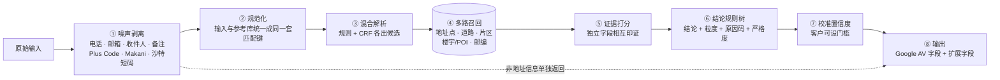
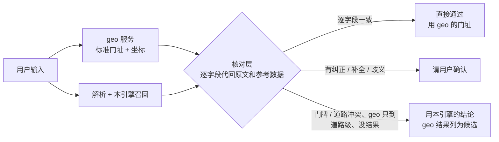

# 00 · 地址校验 MVP 技术方案（最终版）

> 本文只写选定的方案及其效果。选型对比和迭代过程见 07–13 文档。代码在 [`mvp/`](../mvp/README.md)，可直接运行。

---

## 1. 方案一句话

**规则解析 + 机器学习补漏，两者各出候选，由参考数据裁决。结论由可解释的规则树给出，并附校准过的置信度。大模型不进实时路径。**

对外接口与 Google Address Validation 相同，按 `regionCode` 分发到两个引擎，共 **45 个市场**：
**Google AV 覆盖的全部国家 / 地区（美国除外）**，外加 Google 没覆盖的阿联酋、沙特、印尼、泰国、越南、菲律宾。
- **新加坡专用引擎**：逐楼栋验真。
- **与 Google 对标**：Google 覆盖的 38 个市场里，26 个与 Google 估计上限相差 ≤ 3 个百分点（持平）；其余 12 个里拉脱维亚、巴西、英国、智利差 3.2–4.3 个百分点，其他差在开放数据不够（第 8 节）。已有 geo 服务的，可以先用核对层接入（第 5 节）。
- **多市场引擎**：其余 44 个市场，每个国家一个试点城市。各国写法差异全部放在配置里，引擎不分国家写逻辑。

---

## 2. 处理流程

**脏输入为什么也能找到：解析和查库是同一步，拿参考库去读输入。** 用户输入有噪声、错拼、少写、多语言、乱序，没法先"解析干净"再查库，所以：

1. **全位置枚举片段**：输入切词后，从长到短枚举任意位置的连续几个词，逐段去参考库的道路 / 片区 / 楼名索引里查。查得到的才成为候选，查不到的词（商户名、备注、乱码）自然忽略；不依赖词序和逗号。
2. **门牌、邮编、单元按各国规则认**：邮编按各国格式且须在库里存在；门牌取紧挨路名的数字（英美澳法在前，德西拉美在后）；带单元词的归单元。
3. **多种解读并存，由参考库裁决**：`Santiago` 可能是城市也可能是路名，`1050` 可能是邮编也可能是门牌，都保留；每种解读去库里核对门牌是否存在、邮编和片区是否在这条路附近，整条地址最自洽的胜出。所以第一步不需要解析完全正确。

| 问题 | 做法 | 例子 |
|---|---|---|
| 噪声 | 先剥：格式残留、联系方式、订单号、营业时间、字段标签、收件人、公司名、配送备注、方位描述（清单见下表）；剥出的内容放进 `nonAddressInfo` 返回；其余查不到的词自然忽略 | `NatWest, 12 Station Parade` → 忽略银行名，认出路和门牌 |
| 错拼 | 道路名容错检索，门牌号不容错；纠错得到的结论最多 CONFIRM | `Vicuña Mackena` → `Vicuña Mackenna`，请用户确认 |
| 少写 | 每条路存多把匹配键：去类型词的核心名、只写姓、首字母、全称补词；没写的邮编、城市由官方记录补上 | `Gran Avenida 6610` → `Gran Avenida José Miguel Carrera 6610` |
| 多语言 | 统一成一套匹配键：去重音、西里尔文转写、阿拉伯文只比辅音骨架、各语言缩写表；库里存多语言名称和日文两种读法 | `Solunska Street 14` = `ул. Солунска 14` |
| 乱序 | 全位置枚举，不依赖顺序 | `Tokyo, 1 Chome-24-15 Shibuya` → `渋谷区渋谷一丁目24` |

认不出时不硬猜：库里没有这条路、或残留片段一个都对不上，只能定位到片区的判 FIX，有几个接近候选的判 CONFIRM 并列出候选。

**噪声清单与实测**（[`noise.py`](../mvp/avmvp/intl/noise.py)）。按逗号分段逐段判断，判断前先问参考库：这一段完整对上道路 / 片区 / 楼名就保留，不当噪声。实测方法：在 15 个市场开发集里引擎原本定位对的真实地址上，按当地语言注入一类噪声再校验（[`scripts/noise_robustness.py`](../mvp/scripts/noise_robustness.py)，[报告](../mvp/reports/noise_robustness_after.md)）。改之前 → 改之后；改之后所有噪声类型都是**静默错误 0**（直接通过却错了的一条没有）：

| 噪声 | 例子 | 处理 | 注入后仍然对 |
|---|---|---|---|
| 联系方式 | 电话（含 `Tel:` / `HP:` / `هاتف` 标签、巴西 `(11) 98765-4321`）、邮箱、网址 | 按格式剥出 | 99.8–100% |
| 收件人 | `Attn` / `z. Hd.` / `A/C` / `Atención` / `Alla c.a.` / `Penerima` / `المستلم` | 段首标记 → 整段剥出；同一段后面跟着地址时只切掉人名 | 97.8% → 100% |
| 公司名 | `GmbH` / `SARL` / `S.A. de C.V.` / `Ltda.` / `Sp. z o.o.` / `LLC` / `Sdn Bhd` / 印尼 `PT` | 以法律形式结尾、没有数字的段；带楼宇词的（`… CHS Ltd`、`R-City Mall … Limited`）不算 | 98.2% → 100% |
| 配送备注 | `please leave at reception` / `bitte beim Nachbarn abgeben` / `favor deixar na portaria` / `titip di pos satpam` | 没有数字、含配送用语的段 | 99.0% → 100% |
| 营业时间 | `Mo-Fr 9-18 Uhr` / `Seg a Sex 8h às 18h` / `Senin-Jumat 08.00-17.00` | 剥出；原先 `9:00` 会被当成门牌、直接通过却错了 | 98.3% → 100%（静默错误 0.7% → 0） |
| 订单号 | `Order #A123` / `Bestellnr.` / `Pedido nº` / `No. Pesanan` | 剥出 | 99.2% → 100% |
| 字段标签 | `Address:` / `Dirección:` / `Endereço:` / `العنوان:` | 删除（原先 `Dirección` 被当成路名） | 92.8% → 100% |
| 格式残留 | HTML 标签和实体、字面 `\n`、零宽字符、表情符号、全角数字 | 清理 / 统一（原先 ` ` 被当成葡语缩写 BR = Bairro） | HTML 89% → 100%，`\n` 78% → 100% |
| 占位和重复 | `N/A`、`-`、`null`；城市、国家写两三遍 | 库里查不到，自然忽略；城市名不当片区证据 | 99.8–100% |
| 楼层 / 单元 | `2nd floor, Suite 210` / `2. OG` / `3º andar, sala 301` / `Lantai 2` | 认作单元，不当门牌；澳洲邮编后面跟着楼层时也能认出邮编 | 98.3% → 99.7% |
| 坐标 / 编码 | 十进制或度分秒坐标、Plus Code、Makani、沙特短码 | 单独取出直接定位，与所写道路核对 | — |
| 写法 | 全大写 / 全小写、不写逗号、乱序 | 统一匹配键后全位置枚举 | 97.7–100%（不写逗号的阿联酋地址最差，88%） |
| 参照物描述 | `near the station` / `gegenüber vom Bahnhof` / `frente al parque` / `dekat masjid` / `خلف …` | 方位词后面是参照物，不拿去匹配道路；已经认出道路时参照物不参与定位 | 99.2% → 100% |
| 多种叠加 | 标签 + 收件人 + 公司 + 地址 + 楼层 + 备注 + 电话 | 以上同时生效 | 95.7% → 99.7% |

**只有方位描述、没有地址的输入**（"第三棵树后面第二栋"、`third house behind Café Central`）：按"第几栋"推不出是哪一栋（没有房屋顺序数据），所以不猜门牌：
- 描述里的参照物是库里的楼宇或商户（名称完全一致）：定位到参照物附近，`PREMISE_PROXIMITY` + **CONFIRM**（`LANDMARK_RELATIVE`），请用户确认。实测 300 条：94% 请用户确认、0 直接通过，其余 6% 是连锁店（分店太多，判 FIX）；
- 参照物本身是地址（`drittes Haus hinter Horstweg 53C`）：照常解析，但最多 CONFIRM；
- 什么都对不上（`second house after the big tree, blue gate`）：**FIX**（`DESCRIPTIVE_LOCATION`），提示用户给门牌地址，或在地图上标点 / 给 Plus Code。实测 87% 判 FIX，其余是参照物恰好是真实地名；
- 原文的描述放在 `nonAddressInfo.descriptions` / `landmarks`，配送员仍能看到。

配送用语、收件人标记、方位词目前覆盖英、德、法、西、意、葡、波、印尼 / 马来、阿拉伯文；北欧、波罗的海、中东欧、日、泰、越文只按格式剥离（电话、邮箱、订单号、营业时间等），这些语言的备注词还要补。

---

## 3. 各模块的选定做法

| 模块 | 选定做法 | 必须遵守的规则 |
|---|---|---|
| ① 噪声剥离 | 格式残留（HTML、`\n`）、联系方式、订单号、营业时间、字段标签按格式剥出；收件人、公司名、配送备注、方位描述按段判断（9 种语言的标记词）；坐标（十进制 / 度分秒）和地址编码单独取出。新加坡另有专用规则 | 删除前先查参考库，完整对上道路 / 片区 / 楼名的段不删；剥出的内容放进 `nonAddressInfo` 返回，不丢弃；方位描述里的参照物只用来找楼宇 / 商户，不匹配道路 |
| ② 规范化 | 输入和参考库用同一套匹配键：缩写展开、去重音、拆开粘连写法（`500OXFORD`）、合并人名缩写（`M.H.` → `MH`）、邮编去空格 / 连字符 / 国家前缀。阿拉伯文与拉丁文都换算成**辅音骨架**；西里尔文按官方规则转写；日文町丁目统一成"町名 N CHOME 番地-号" | 各市场的写法差异放在配置里（[`markets.py`](../mvp/avmvp/intl/markets.py)、[`text.py`](../mvp/avmvp/intl/text.py)），不写进引擎 |
| ③ 解析 | **混合**：规则（地名表最长匹配 + 各市场写法）和 CRF 序列标注各出候选。CRF 用参考库按各国写法渲染的 2 万条样本训练，不需要人工标注 | 门牌号可以有多种解释，交给参考库裁决；数字不做模糊匹配（`Ave 3` 不能纠成 `Ave 5`） |
| ④ 召回 | 道路按以下顺序查找：完整名 → 去类型词 → 容错 → 转写骨架 → 泰文无空格；人名道路的全称 / 简称、斯拉夫语物主形容词写法也进候选。片区、楼宇/POI、邮编各自召回；一户一码的邮编（爱尔兰、英国）查不到时用上一级片区。**门牌位置**依次查：官方地址点 → OSM 门牌点 → 商户地址门牌点 → 相邻门牌推算 / 区间插值 | 路段按线形每约 80 米取一点；同名路段合并；人名道路、日文町名生成别名；地址表与路网写法不同的同一条路合并；OSM / 商户门牌点只在开发集上证明有用的市场启用 |
| ⑤ 打分 | 证据强度依次为：官方地址点 > 相邻门牌 > 楼宇在所写道路旁 > 邮编与道路相互印证 > 片区包含 > 单一线索 | 两个独立字段相互印证，强于任何单一字段；纠错得来的证据弱于原样一致的证据 |
| ⑥ 结论 | 可读的规则树，每个分支对应一个原因码；严格度分 STRICT / BALANCED / LENIENT 三档。口径与 Google 一致：没写门牌 → FIX；道路对上、门牌不在库里 → 道路级 + CONFIRM。默认规则之外，按市场在开发集上校准放宽规则：某个证据组合正确率 ≥ 95%、偏差 >1 公里 ≤ 2% 才允许直接通过 | 替换要保守：线索互相矛盾时给候选，不擅自替换 |
| ⑦ 置信度 | 置信度等于同类结论（按市场、结论、粒度、证据组合分类）在标注数据上的**实际正确率**。样本少的细类向粗类收缩（Beta 先验） | 低于客户门槛的 ACCEPT 降为 CONFIRM（原因码 `LOW_CONFIDENCE`），选中的地址不变 |
| ⑧ 输出 | 字段与 Google AV 相同；另有原因码 + 说明、候选地址、`nonAddressInfo`、`codes`、`confidence`；地址按各国格式输出 | — |

---

## 4. 按市场数据条件分三类

| 类别 | 市场 | 验真依据 | 最高粒度 | 直接通过（ACCEPT）的条件 |
|---|---|---|---|---|
| **A**（31 个） | 新加坡、澳洲、新西兰、日本、加拿大、墨西哥、巴西、智利、哥伦比亚、保加利亚；欧洲 21 国：德、法、荷、比、卢、瑞士、奥地利、意、西、葡、丹麦、挪威、芬兰、爱沙尼亚、拉脱维亚、立陶宛、波兰、捷克、斯洛伐克、斯洛文尼亚、克罗地亚 | 官方地址表逐个门牌核对（哥伦比亚、保加利亚另补市政府开放的门牌数据）；官方表缺的门牌用 OSM 门牌、商户地址门牌点补 | `PREMISE`；多单元楼缺单元号时给 `CONFIRM_ADD_SUBPREMISES` | 门牌在官方表里，且没有纠错或替换；只有 OSM 有的门牌按开发集校准的组合放行 |
| **B**（2 个） | 阿联酋、沙特 | 道路、片区、楼宇/POI（Overture / OSM） | `PREMISE_PROXIMITY` | 楼名在所写道路旁；或 Plus Code 与所写道路、片区一致 |
| **C**（12 个） | 马来西亚、印尼、泰国、越南、菲律宾、英国、爱尔兰、瑞典、匈牙利、阿根廷、印度、波多黎各 | 欧美的 6 个用 **OSM 门牌**（英国、爱尔兰、瑞典、匈牙利、阿根廷、波多黎各）；其余同 B | `PREMISE`（OSM 门牌）/ `PREMISE_PROXIMITY` / `ROUTE` | 门牌点或道路级：邮编印证、道路名在城市内唯一、名称完全一致（或本市场开发集上同样可靠的组合）；楼宇 / Plus Code 同 B |

- 其余情况：
  - 能给出位置的判 **CONFIRM** 并附候选（A 类门牌不在表里时，紧挨着的门牌在就按相邻门牌给位置，否则给道路级位置，都判 CONFIRM，与 Google 一致）；
  - 没写门牌、只能定位到片区或什么都找不到的判 **FIX**。
- 不管哪一类，只要获得门牌数据，引擎就走 A 类路径，代码不用改。
- 这 44 个市场以外的国家，带了 geo 结果的请求也能核对（第 5 节"没有参考库的国家"）。

**试点城市以外的地址（范围守卫）**。每个国家的参考库只有一个试点城市，真实流量却是全国的：已有的 1,000 条 geo 测试结果里，落在这 44 个市场的 636 条约七成在试点城市以外。参考库里没有这些地址，原先引擎会把它们配到试点城市的同名路上（`Goethestr. 38, Glienicke/Nordbahn` → 柏林的 Goethestraße），直接通过的就是静默错误。评测样本都在试点城市里，所以评测看不出这类错误。

做法（[`coverage.py`](../mvp/avmvp/intl/coverage.py)）：
- **数据**：用 GeoNames 全国地名 / 邮编表（居民点、各级行政区、当地语言别名、邮编位置）判断输入里写的城镇、邮编、州在不在试点范围内。
- **判定**：按段计分，越具体的分越高（邮编 3、城镇 2、片区 1、州 1、国名 / 全城名 0.5）。范围外的分高于范围内才判"范围外"。
- **排除**：第一段（多是路名）、带门牌的段、引擎配上的那条路本身都不算城镇证据，因为拉美道路常以城镇命名。写了范围内的城镇、只有邮编在范围外的，按邮编写错处理。
- **范围外的结论**：不再匹配试点城市的道路。只给城镇级位置（`LOCALITY`）：写全了道路和门牌的请用户确认（CONFIRM），否则 FIX，原因码 `OUTSIDE_COVERAGE`。带了 geo 结果的，按第 5 节核对后可以直接采用。

| 检验 | 结果 |
|---|---|
| 开发集（全部在试点范围内）被误判成范围外 | 真实商户地址 26,400 条误判 35 条（0.13%），合成地址 13,200 条误判 2 条（0.02%）。误判的多是商户地址本身写的是别的城镇（[报告](../mvp/reports/coverage_guard.md)） |
| geo 测试日志里，所在州明确不是试点州的 391 条 | 拦下 367 条（94%）；配到试点城市同名路的 289 条 → 21 条，其中直接通过的 21 条 → 3 条 |

守卫只保证不配错，验不了。这些地址要验真，得把参考库扩到全国（第 9 节 P0）。

---

## 5. 接入已有的 geo 服务（核对层）

已有的 geo 服务对同一输入返回一条库里的标准门址（分字段，与 Google 地理编码相同）和坐标，但它解析错了也照样给，线上又没有标准答案可对。**判断它对不对不需要标准答案**：把 geo 的门址代回用户原文和参考数据，看是否自洽，就像把解代回方程（[`geo_check.py`](../mvp/avmvp/intl/geo_check.py)，请求里带 `geoResult` 即启用）。

| geo 门址的字段在原文里…… | 判定 | 例子 |
|---|---|---|
| 出现了，而且一样（去类型词、别名、只写姓也算） | 确认 | `Calle Ventosa 23` ↔ Calle de la Ventosa 23 |
| 出现了但写法不同 | 纠正 → 请用户确认 | `Crwn St` ↔ Crown Street |
| 用户没写，是 geo 补的 | 补全：邮编、城市可以补；门牌不能补（判 FIX） | 没写门牌，geo 给了 100 号 |
| 用户写了不同的值 | 冲突 → 不用 geo，改用本引擎 | 输入 104 号，geo 给 100 号；输入 Station Parade，geo 给 Station Road |

另有三项独立检查：所写邮编的中心离 geo 坐标太远（二者必有一错）；所写片区不包含 geo 坐标；同名道路在别处也有这个门牌而输入里没有邮编 / 片区能区分。本引擎的结论同时算出（几毫秒），两边位置一致时沿用本引擎校准过的置信度。

试点城市以外的地址（第 4 节范围守卫），参考库里没有，核对改用全国地名 / 邮编表：
- geo 坐标要在所写城镇或邮编附近；
- 门牌、道路逐字段一致才直接通过（`OUTSIDE_COVERAGE` + `GEO_VERIFIED`）；
- geo 选了别的城镇的同名路（坐标不在所写城镇）时不采用，保留城镇级结论，geo 结果列为候选。

**模拟评测**（[报告](../mvp/reports/geo_check_eval.md)，[`scripts/geo_check_eval.py`](../mvp/scripts/geo_check_eval.py)）：17 个市场开发集真实输入，以本引擎定位对的门牌点当标准答案，按参考库构造 geo 的几种错法：

| geo 返回 | 核对层 + 本引擎：直接通过 / 误放行 / 最终对 | 只有核对层（本引擎什么都没找到）：直接通过 / 误放行 |
|---|---|---|
| 正确 | 94.7% / 0 / 100% | 93.7% / 0 |
| 门牌吸附到隔壁 | geo 被拦下，本引擎找回：误放行 0，最终对 99.9% | 0 / 0（99.9% 判 FIX） |
| 同名路选错（2 公里外） | 误放行 0，最终对 99.1% | 0 / 0（20% 请用户确认，80% 判 FIX） |
| 相邻路选错 | 误放行 0，最终对 99.9% | 0 / 0 |
| 只到道路级 / 没有结果 | 本引擎接手：最终对 100% | 0 / 0 |

结论：geo 对的时候绝大多数直接用（94%）；geo 错的 2,065 条一条都没放行。只有核对层时，geo 正确而没直接通过的 6% 主要是商户写的邮编与官方不同（葡萄牙、波兰的邮编细到路段，与本引擎同样请用户确认）。

**真实 geo 返回评测**（[报告](../mvp/reports/geo_real_eval.md)，[`scripts/geo_real_eval.py`](../mvp/scripts/geo_real_eval.py)）。数据是 851 条线上查询（34 个国家，都是 Google 判对的地址），每条有 geo 返回的第一个门址和坐标，以及库内目标门址坐标（标准答案）。判定：离目标 ≤ 100 米算对，> 500 米算错，与人工判定的 recall 66.6%、accuracy 错误 214 条吻合。

| 分组 | 条数 | geo 对 / 错 | 直接用 geo：错的被采用 | 加核对层：直接通过 | 其中错 | geo 错被拦下 | geo 对被放行 |
|---|---|---|---|---|---|---|---|
| 全部 | 851 | 65.9% / 25.0% | 213 条（25.0%） | 437 条（51.4%） | 14 条（3.2%） | 93.9% | 67.4% |
| 本方案市场·试点城市内（参考库核对） | 217 | 67.7% / 21.7% | 47 条 | 123 条 | 5 条 | 91.5% | 66.7% |
| 本方案市场·试点城市外（原文 + 全国地名 / 邮编表） | 356 | 71.9% / 22.8% | 81 条 | 190 条 | 4 条 | 95.1% | 70.3% |
| 没有参考库的国家（海湾、埃及、中亚、秘鲁、多米尼加、土耳其、南非） | 278 | 56.8% / 30.6% | 85 条 | 124 条 | 5 条 | 94.1% | 63.3% |

- **结论**：直接用 geo，每 4 条就有 1 条错地址被采用；加上核对层，被采用的错地址从 213 条降到 14 条，geo 对的有三分之二直接通过，其余请用户确认。随机分成两半，误放行率分别是 3.8% 和 2.7%，拦截率 93.5% 和 94.3%。
- **剩下的 14 条误放行，12 条从文字上查不出**：geo 返回的路名和门牌与标准答案完全一致，只是坐标偏了 500 米以上（geo 库里的坐标错了，或同城同名路选错了）。要再降，得靠 geo 侧修坐标，或者用签收坐标校正。
- **geo 对了却没放行的**主要是用户写错了路名、geo 纠正对了（`Eujenia` → `Eugenia`、`Portmann` → `Portman`）。这类和 Google 一样请用户确认；如果直接放行，错的会从 3.2% 升到约 5%。
- **geo 返回本身要修的问题**：
  - 56% 的结果门牌号字段里是类型词，门牌混在路名里（`number: "ULICA"`、`street: "1 MAJA 3"`），核对层按完整地址重新拆；
  - 少量 UTF-8 乱码（`Avenida México`）；
  - 泰国曼谷的不同地址返回同一个兜底地址和坐标（0902 那批数据）。
- **没有参考库的国家也能用**：请求里带 `geoResult`、国家不在 44 个市场里时，只用原文和全国地名表（GeoNames）核对：门牌、路名逐字段对原文，坐标要落在所写城镇里，编号路名（`شارع 18`）最多请用户确认。

模拟评测（上表，本引擎定位对的样本 + 构造的 geo 错法）在加入这些规则后：geo 正确时直接通过 95.1%，几种错法的误放行仍是 0。

---

## 6. AI 的位置

| AI 组件 | 是否在实时路径 | 用法 |
|---|---|---|
| CRF 序列标注 | **是**，默认开启 | 补规则的漏，用合成数据训练，每条耗时毫秒级 |
| 贝叶斯式置信度 | **是**，默认开启 | 不负责选地址，只给结论配置信度 |
| 本地小模型（Qwen3-4B，GGUF / OpenAI 兼容接口） | **否**，默认关闭 | 只用于离线批量，或有 GPU 时按市场开启（菲律宾、阿联酋、沙特）。规则 + CRF 没能直接通过时才调用。防编造：数字必须在原文里出现，名称必须对得上原文；在没有官方地址表的市场，最多给 CONFIRM |

---

## 7. 接口与部署

| 项 | 方案 |
|---|---|
| 接口 | `POST /v1/address:validate`、`POST /v1/address:batchValidate`（≤1,000 条）、`GET /v1/markets`、`/healthz`。完整定义见 [openapi.yaml](openapi.yaml) |
| 离线清洗 | `scripts/batch_validate.py`：读入 CSV，在原表后追加结论、标准化地址、坐标、原因码和候选 |
| 部署 | Docker 镜像约 660 MB。参考数据在运行时挂载（`AV_MARKETS_DIR`，44 个市场合计约 3.8 GB），更新数据不用重新发版。各市场引擎首次请求时加载，也可以在启动时预加载 |
| 性能 | 新加坡 P50 约 1 ms、P95 约 13 ms；多市场平均 1–8 ms/条。目标是 P95 ≤ 200 ms，余量很大 |
| 客户可调参数 | `strictness`（三档）、`confidenceThreshold`（0–1） |

建议的置信度门槛：

| 类别 | 门槛 | 依据（测试集） |
|---|---|---|
| A 类 | 不设（要更稳设 0.95） | 不设：自动通过 78%，其中偏差超过 1 公里 2.0%；0.95：自动通过 55%，偏差超过 1 公里 1.3% |
| C 类 | 0.9 | 自动通过 33%，其中偏差超过 1 公里 2.2%（不设门槛时为自动通过 39%、偏差超过 1 公里 2.8%） |
| B 类 | 不做自动通过 | 全部走"确认 + 候选"，等接入自有楼栋数据后再开 |

---

## 8. 效果（留出测试集，开发期间从未看过）

**新加坡**（2026 年官方地址表，8,000 条真实人写地址）：

| 直接通过 | 误拒 | 静默错误 |
|---|---|---|
| **85.9%** | 0.7% | **0** |

**多市场**（44 个市场，每个市场 1,000 条真实商户自填地址，商户本身不在参考库里；逐国结果见 [13 文档第 2 节](13-multi-market-product.md)）：

| 类别 | 市场数 | 定位对 | 直接通过 | 偏差 >1 公里的静默错误 |
|---|---|---|---|---|
| A（官方地址表） | 30 | 中位数 90%（哥伦比亚 73% – 德国 97%） | 中位数 79%（葡萄牙 16% – 德国 94%） | 25 个 ≤ 2.0%；斯洛文尼亚 6.1%、拉脱维亚 4.0%、哥伦比亚 3.3%、保加利亚 2.8%（多为商户坐标本身标错） |
| C：欧洲 + 阿根廷 | 4 | 瑞典 94%、匈牙利 91%、阿根廷 91%、英国 88% | 54–83% | 1.0–1.3% |
| C：其他 | 8 | 东南亚 61–71%、爱尔兰 74%、波多黎各 59%、印度 38% | 11–32% | 0.7–1.5% |
| B（中东） | 2 | 阿联酋 33%、沙特 39% | 2–3% | 0.4–0.5% |

**与 Google AV 对标**（Google 覆盖的 38 个市场，美国除外；逐国见 [13 文档第 2.1 节](13-multi-market-product.md)）：没有调用 Google（服务条款不允许用它的输出改进竞品），按 Google 公开的判定规则在同一测试集上估 Google 的上限（没写门牌 / 楼名的 Google 判 FIX、标注噪声 Google 同样判错，其余一律算 Google 做对，偏向 Google）。**差距 ≤ 3 个百分点视为持平：26 / 38 个市场持平**（欧洲 19 国、澳洲、新西兰、日本、加拿大、瑞典、阿根廷、匈牙利）。没持平的 12 个：拉脱维亚、巴西、英国、智利差 3.2–4.3 个百分点；爱尔兰、保加利亚、葡萄牙、墨西哥差 5–9 个；马来西亚、哥伦比亚、波多黎各、印度差 13–35 个，都是开放数据不够（官方表不全或没有、OSM 门牌少），需要接入当地官方全量地址表或自有门牌数据。哥伦比亚、保加利亚补了市政府开放的门牌数据后，差距分别从 18.6、12.2 降到 16.0、6.9 个百分点。

- **置信度**：44 个市场测试集上校准误差 1.2%，区分对错的 AUROC 0.860。
- **为什么说是最优**，以下都是同一测试集上的对比：

| 对比 | 结果 |
|---|---|
| 地理编码式的整串模糊匹配 | 新加坡完全正确率 53.9%，本方案 99.9% |
| 混合解析 vs 纯规则、纯 CRF | 混合在 44 个市场的真实地址上都是最好或与最好相差不超过 0.6 个百分点 |
| 贝叶斯选地址 vs 规则选地址 | 贝叶斯选地址不如规则（新加坡 98.6% vs 99.9%） |
| 加上本地小模型 | 只多 −4 到 +4 个百分点，每次 7–9 秒 |
| 去掉任一核心模块（邮编交叉校验、楼宇名召回、道路拼写纠错） | 下降 4.9–12.7 个百分点 |

---

## 9. 上线前必须做的

| 优先级 | 事项 | 原因 |
|---|---|---|
| P0 | **没持平的 12 个 Google 市场接当地全量门牌数据**：墨西哥（INEGI）、葡萄牙（CTT）、爱尔兰（Eircode 库）、马来西亚、波多黎各、印度（自有楼栋门牌）；哥伦比亚、保加利亚已补市政府开放数据，还差商户邮编质量和小区写法 | 差距来自"门牌不在库里"和"同名道路选错"，解析在合成地址上已到 78–96% |
| P0 | 中东、东南亚接入**自有楼栋、门牌、POI 数据** | 这些市场开放门牌数据（OSM、商户自填）用了反而变差，只能验到道路 |
| P0 | 用**真实订单 + 签收坐标**重新评测，并重拟合置信度和放宽规则 | 目前的标注是商户坐标（弱标注，噪声因国家而异，斯洛文尼亚 10.5%、拉脱维亚 7.2%） |
| P0 | **数据授权**：新加坡用 OneMap/SLA 当前数据并按月更新；Overture 标为专有许可的地址表（澳洲、巴西、加拿大、墨西哥、丹麦、爱沙尼亚、克罗地亚、瑞士）和 ODbL（路网、OSM 门牌）需法务确认 | 参考库的时效和授权决定产品上限：新加坡 2017 库换成 2026 库后，找对率 +7.1 个百分点 |
| P0 | **geo 接入核对层上线**：请求带 `geoResult`，只采用直接通过的结果，其余请用户确认 | 851 条真实返回上，被采用的错地址从 213 条降到 14 条（第 5 节） |
| P0 | **geo 侧修复**：门牌号 / 路名字段拆错（56% 的结果）、UTF-8 乱码、泰国兜底地址；文字对但坐标偏 500 米以上的门址（核对层剩下的误放行 12 / 14 条都是这类） | 这些从文字上查不出，只能在 geo 库里修 |
| P1 | 用签收坐标重新评测 geo + 核对层 | 目前标准答案是库内目标门址坐标；签收坐标能直接反映配送是否送对 |
| P0 | **试点城市扩到全国**：在 `markets.py` 里扩大范围后重建参考库，引擎不用改 | 线上这 44 个市场的查询约七成在试点城市外。范围守卫只能做到不配错（只给城镇级），验不了 |
| P0 | **新市场**：科威特、巴林、阿曼、卡塔尔、埃及、哈萨克斯坦、乌兹别克斯坦、秘鲁、多米尼加、土耳其、南非 | 占 geo 测试结果的 35%，目前没有覆盖；geo 出错最集中的是海湾国家（科威特 48 / 52、阿曼 28 / 38，街区 + 街道 + 楼号的写法）和埃及 |
| P1 | 法务确认后，在同一批真实订单上**实测 Google AV 与 Loqate** | 目前与 Google 的对比是按公开规则估的上限 |
| P1 | 街道改名记录（里加 Maskavas iela → Latgales iela 这类） | 旧名在路网和地址表里都已没有 |
