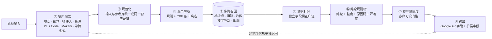

# 00 · 地址校验 MVP 技术方案（最终版）

> 本文只写选定的方案及其效果。选型对比和迭代过程见 07–13 文档。代码在 [`mvp/`](../mvp/README.md)，可直接运行。

---

## 1. 方案一句话

**规则解析 + 机器学习补漏，两者各出候选，由参考数据裁决。结论由可解释的规则树给出，并附校准过的置信度。大模型不进实时路径。**

对外接口与 Google Address Validation 相同，按 `regionCode` 分发到两个引擎，共 **45 个市场**：
**Google AV 覆盖的全部国家 / 地区（美国除外）**，外加 Google 没覆盖的阿联酋、沙特、印尼、泰国、越南、菲律宾。
- **新加坡专用引擎**：逐楼栋验真。
- **与 Google 对标**：Google 覆盖的 38 个市场里，25 个与 Google 估计上限相差 ≤ 3 个百分点（持平）；其余 13 个差在开放数据不够（第 7 节）。
- **多市场引擎**：其余 44 个市场，每个国家一个试点城市。各国写法差异全部放在配置里，引擎不分国家写逻辑。

---

## 2. 处理流程

---

## 3. 各模块的选定做法

| 模块 | 选定做法 | 必须遵守的规则 |
|---|---|---|
| ① 噪声剥离 | 正则抽出电话、邮箱、网址、邮政信箱、坐标和地址编码。新加坡另外剥离收件人、公司名和配送备注 | 删除前先查参考库，确认这一段不是楼名；剥出的内容放进 `nonAddressInfo` 返回，不丢弃 |
| ② 规范化 | 输入和参考库用同一套匹配键：缩写展开、去重音、拆开粘连写法（`500OXFORD`）、合并人名缩写（`M.H.` → `MH`）、邮编去空格 / 连字符 / 国家前缀。阿拉伯文与拉丁文都换算成**辅音骨架**；西里尔文按官方规则转写；日文町丁目统一成"町名 N CHOME 番地-号" | 各市场的写法差异放在配置里（[`markets.py`](../mvp/avmvp/intl/markets.py)、[`text.py`](../mvp/avmvp/intl/text.py)），不写进引擎 |
| ③ 解析 | **混合**：规则（地名表最长匹配 + 各市场写法）和 CRF 序列标注各出候选。CRF 用参考库按各国写法渲染的 2 万条样本训练，不需要人工标注 | 门牌号可以有多种解释，交给参考库裁决；数字不做模糊匹配（`Ave 3` 不能纠成 `Ave 5`） |
| ④ 召回 | 道路按以下顺序查找：完整名 → 去类型词 → 容错 → 转写骨架 → 泰文无空格；人名道路的全称 / 简称、斯拉夫语物主形容词写法也进候选。片区、楼宇/POI、邮编各自召回；一户一码的邮编（爱尔兰、英国）查不到时用上一级片区。**门牌位置**依次查：官方地址点 → OSM 门牌点 → 商户地址门牌点 → 相邻门牌推算 / 区间插值 | 路段按线形每约 80 米取一点；同名路段合并；人名道路、日文町名生成别名；地址表与路网写法不同的同一条路合并；OSM / 商户门牌点只在开发集上证明有用的市场启用 |
| ⑤ 打分 | 证据强度依次为：官方地址点 > 相邻门牌 > 楼宇在所写道路旁 > 邮编与道路相互印证 > 片区包含 > 单一线索 | 两个独立字段相互印证，强于任何单一字段；纠错得来的证据弱于原样一致的证据 |
| ⑥ 结论 | 可读的规则树，每个分支对应一个原因码；严格度分 STRICT / BALANCED / LENIENT 三档。口径与 Google 一致：没写门牌 → FIX；道路对上、门牌不在库里 → 道路级 + CONFIRM。默认规则之外，按市场在开发集上校准放宽规则：某个证据组合正确率 ≥ 95%、偏差 >1 公里 ≤ 2% 才允许直接通过 | 替换要保守：线索互相矛盾时给候选，不擅自替换 |
| ⑦ 置信度 | 置信度等于同类结论（按市场、结论、粒度、证据组合分类）在标注数据上的**实际正确率**。样本少的细类向粗类收缩（Beta 先验） | 低于客户门槛的 ACCEPT 降为 CONFIRM（原因码 `LOW_CONFIDENCE`），选中的地址不变 |
| ⑧ 输出 | 字段与 Google AV 相同；另有原因码 + 说明、候选地址、`nonAddressInfo`、`codes`、`confidence`；地址按各国格式输出 | — |

---

## 4. 按市场数据条件分三类

| 类别 | 市场 | 验真依据 | 最高粒度 | 直接通过（ACCEPT）的条件 |
|---|---|---|---|---|
| **A**（31 个） | 新加坡、澳洲、新西兰、日本、加拿大、墨西哥、巴西、智利、哥伦比亚、保加利亚；欧洲 21 国：德、法、荷、比、卢、瑞士、奥地利、意、西、葡、丹麦、挪威、芬兰、爱沙尼亚、拉脱维亚、立陶宛、波兰、捷克、斯洛伐克、斯洛文尼亚、克罗地亚 | 官方地址表逐个门牌核对（哥伦比亚、保加利亚另补市政府开放的门牌数据）；官方表缺的门牌用 OSM 门牌、商户地址门牌点补 | `PREMISE`；多单元楼缺单元号时给 `CONFIRM_ADD_SUBPREMISES` | 门牌在官方表里，且没有纠错或替换；只有 OSM 有的门牌按开发集校准的组合放行 |
| **B**（2 个） | 阿联酋、沙特 | 道路、片区、楼宇/POI（Overture / OSM） | `PREMISE_PROXIMITY` | 楼名在所写道路旁；或 Plus Code 与所写道路、片区一致 |
| **C**（12 个） | 马来西亚、印尼、泰国、越南、菲律宾、英国、爱尔兰、瑞典、匈牙利、阿根廷、印度、波多黎各 | 欧美的 6 个用 **OSM 门牌**（英国、爱尔兰、瑞典、匈牙利、阿根廷、波多黎各）；其余同 B | `PREMISE`（OSM 门牌）/ `PREMISE_PROXIMITY` / `ROUTE` | 门牌点或道路级：邮编印证、道路名在城市内唯一、名称完全一致（或本市场开发集上同样可靠的组合）；楼宇 / Plus Code 同 B |

- 其余情况：
  - 能给出位置的判 **CONFIRM** 并附候选（A 类门牌不在表里时，紧挨着的门牌在就按相邻门牌给位置，否则给道路级位置，都判 CONFIRM，与 Google 一致）；
  - 没写门牌、只能定位到片区或什么都找不到的判 **FIX**。
- 不管哪一类，只要获得门牌数据，引擎就走 A 类路径，代码不用改。

---

## 5. AI 的位置

| AI 组件 | 是否在实时路径 | 用法 |
|---|---|---|
| CRF 序列标注 | **是**，默认开启 | 补规则的漏，用合成数据训练，每条耗时毫秒级 |
| 贝叶斯式置信度 | **是**，默认开启 | 不负责选地址，只给结论配置信度 |
| 本地小模型（Qwen3-4B，GGUF / OpenAI 兼容接口） | **否**，默认关闭 | 只用于离线批量，或有 GPU 时按市场开启（菲律宾、阿联酋、沙特）。规则 + CRF 没能直接通过时才调用。防编造：数字必须在原文里出现，名称必须对得上原文；在没有官方地址表的市场，最多给 CONFIRM |

---

## 6. 接口与部署

| 项 | 方案 |
|---|---|
| 接口 | `POST /v1/address:validate`、`POST /v1/address:batchValidate`（≤1,000 条）、`GET /v1/markets`、`/healthz`。完整定义见 [openapi.yaml](openapi.yaml) |
| 离线清洗 | `scripts/batch_validate.py`：读入 CSV，在原表后追加结论、标准化地址、坐标、原因码和候选 |
| 部署 | Docker 镜像约 660 MB。参考数据在运行时挂载（`AV_MARKETS_DIR`，44 个市场合计约 3.8 GB），更新数据不用重新发版。各市场引擎首次请求时加载，也可以在启动时预加载 |
| 性能 | 新加坡 P50 约 1 ms、P95 约 13 ms；多市场平均 1–8 ms/条。目标是 P95 ≤ 200 ms，余量很大 |
| 客户可调参数 | `strictness`（三档）、`confidenceThreshold`（0–1） |

建议的置信度门槛：

| 类别 | 门槛 | 依据（测试集） |
|---|---|---|
| A 类 | 不设（要更稳设 0.95） | 不设：自动通过 78%，其中偏差超过 1 公里 2.0%；0.95：自动通过 55%，偏差超过 1 公里 1.3% |
| C 类 | 0.9 | 自动通过 33%，其中偏差超过 1 公里 2.2%（不设门槛时为自动通过 39%、偏差超过 1 公里 2.8%） |
| B 类 | 不做自动通过 | 全部走"确认 + 候选"，等接入自有楼栋数据后再开 |

---

## 7. 效果（留出测试集，开发期间从未看过）

**新加坡**（2026 年官方地址表，8,000 条真实人写地址）：

| 直接通过 | 误拒 | 静默错误 |
|---|---|---|
| **85.9%** | 0.7% | **0** |

**多市场**（44 个市场，每个市场 1,000 条真实商户自填地址，商户本身不在参考库里；逐国结果见 [13 文档第 2 节](13-multi-market-product.md)）：

| 类别 | 市场数 | 定位对 | 直接通过 | 偏差 >1 公里的静默错误 |
|---|---|---|---|---|
| A（官方地址表） | 30 | 中位数 90%（哥伦比亚 73% – 德国 97%） | 中位数 79%（葡萄牙 16% – 德国 94%） | 25 个 ≤ 2.0%；斯洛文尼亚 6.1%、拉脱维亚 4.0%、哥伦比亚 3.3%、保加利亚 2.8%（多为商户坐标本身标错） |
| C：欧洲 + 阿根廷 | 4 | 匈牙利 91%、瑞典 91%、阿根廷 91%、英国 88% | 54–81% | 1.0–1.3% |
| C：其他 | 8 | 东南亚 61–71%、爱尔兰 74%、波多黎各 59%、印度 38% | 11–32% | 0.7–1.5% |
| B（中东） | 2 | 阿联酋 33%、沙特 39% | 2–3% | 0.4–0.5% |

**与 Google AV 对标**（Google 覆盖的 38 个市场，美国除外；逐国见 [13 文档第 2.1 节](13-multi-market-product.md)）：没有调用 Google（服务条款不允许用它的输出改进竞品），按 Google 公开的判定规则在同一测试集上估 Google 的上限（没写门牌 / 楼名的 Google 判 FIX、标注噪声 Google 同样判错，其余一律算 Google 做对，偏向 Google）。**差距 ≤ 3 个百分点视为持平：25 / 38 个市场持平**（欧洲 19 国、澳洲、新西兰、日本、加拿大、阿根廷、匈牙利）。没持平的 13 个：拉脱维亚、英国、巴西、瑞典、智利差 3–5 个百分点；爱尔兰、保加利亚、葡萄牙、墨西哥差 5–9 个；马来西亚、哥伦比亚、波多黎各、印度差 13–35 个，都是开放数据不够（官方表不全或没有、OSM 门牌少），需要接入当地官方全量地址表或自有门牌数据。哥伦比亚、保加利亚补了市政府开放的门牌数据后，差距分别从 18.6、12.2 降到 15.8、6.8 个百分点。

- **置信度**：44 个市场测试集上校准误差 1.1%，区分对错的 AUROC 0.860。
- **为什么说是最优**，以下都是同一测试集上的对比：

| 对比 | 结果 |
|---|---|
| 地理编码式的整串模糊匹配 | 新加坡完全正确率 53.9%，本方案 99.9% |
| 混合解析 vs 纯规则、纯 CRF | 混合在 44 个市场的真实地址上全部最好或并列最好 |
| 贝叶斯选地址 vs 规则选地址 | 贝叶斯选地址不如规则（新加坡 98.6% vs 99.9%） |
| 加上本地小模型 | 只多 −4 到 +4 个百分点，每次 7–9 秒 |
| 去掉任一核心模块（邮编交叉校验、楼宇名召回、道路拼写纠错） | 下降 4.9–12.7 个百分点 |

---

## 8. 上线前必须做的

| 优先级 | 事项 | 原因 |
|---|---|---|
| P0 | **没持平的 13 个 Google 市场接当地全量门牌数据**：墨西哥（INEGI）、葡萄牙（CTT）、爱尔兰（Eircode 库）、马来西亚、波多黎各、印度（自有楼栋门牌）；哥伦比亚、保加利亚已补市政府开放数据，还差商户邮编质量和小区写法 | 差距来自"门牌不在库里"和"同名道路选错"，解析在合成地址上已到 78–96% |
| P0 | 中东、东南亚接入**自有楼栋、门牌、POI 数据** | 这些市场开放门牌数据（OSM、商户自填）用了反而变差，只能验到道路 |
| P0 | 用**真实订单 + 签收坐标**重新评测，并重拟合置信度和放宽规则 | 目前的标注是商户坐标（弱标注，噪声因国家而异，斯洛文尼亚 10.5%、拉脱维亚 7.2%） |
| P0 | **数据授权**：新加坡用 OneMap/SLA 当前数据并按月更新；Overture 标为专有许可的地址表（澳洲、巴西、加拿大、墨西哥、丹麦、爱沙尼亚、克罗地亚、瑞士）和 ODbL（路网、OSM 门牌）需法务确认 | 参考库的时效和授权决定产品上限：新加坡 2017 库换成 2026 库后，找对率 +7.1 个百分点 |
| P1 | 法务确认后，在同一批真实订单上**实测 Google AV 与 Loqate** | 目前与 Google 的对比是按公开规则估的上限 |
| P1 | 街道改名记录（里加 Maskavas iela → Latgales iela 这类） | 旧名在路网和地址表里都已没有 |
| P1 | 试点城市扩到全国 | 在 `markets.py` 里扩大范围后重建参考库即可，引擎不用改 |
