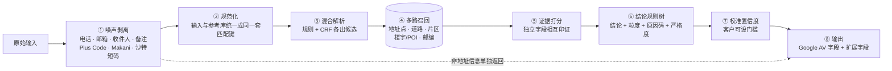

# 00 · 地址校验 MVP 技术方案（最终版）

> 本文只写选定的方案及其效果。选型对比和迭代过程见 07–13 文档。代码在 [`mvp/`](../mvp/README.md)，可直接运行。

---

## 1. 方案一句话

**规则解析 + 机器学习补漏，两者各出候选，由参考数据裁决。结论由可解释的规则树给出，并附校准过的置信度。大模型不进实时路径。**

对外接口与 Google Address Validation 相同，按 `regionCode` 分发到两个引擎：
- **新加坡专用引擎**：逐楼栋验真。
- **多市场引擎**：覆盖澳洲、德国、法国、荷兰、阿联酋、沙特、马来西亚、印尼、泰国、越南、菲律宾。

---

## 2. 处理流程

---

## 3. 各模块的选定做法

| 模块 | 选定做法 | 必须遵守的规则 |
|---|---|---|
| ① 噪声剥离 | 正则抽出电话、邮箱、网址、邮政信箱、坐标和地址编码。新加坡另外剥离收件人、公司名和配送备注 | 删除前先查参考库，确认这一段不是楼名；剥出的内容放进 `nonAddressInfo` 返回，不丢弃 |
| ② 规范化 | 输入和参考库用同一套匹配键：缩写展开、去重音、拆开粘连写法（`500OXFORD`）、合并人名缩写（`M.H.` → `MH`）。阿拉伯文与拉丁文都换算成**辅音骨架**后再比较 | 各市场的写法差异放在配置里（[`markets.py`](../mvp/avmvp/intl/markets.py)、[`text.py`](../mvp/avmvp/intl/text.py)），不写进引擎 |
| ③ 解析 | **混合**：规则（地名表最长匹配 + 各市场写法）和 CRF 序列标注各出候选。CRF 用参考库按各国写法渲染的 2 万条样本训练，不需要人工标注 | 门牌号可以有多种解释，交给参考库裁决；数字不做模糊匹配（`Ave 3` 不能纠成 `Ave 5`） |
| ④ 召回 | 道路按以下顺序查找：完整名 → 去类型词 → 容错 → 转写骨架 → 泰文无空格。片区、楼宇/POI、邮编各自召回 | 路段按线形每约 80 米取一点；同名路段合并；人名道路生成缩写别名 |
| ⑤ 打分 | 证据强度依次为：官方地址点 > 楼宇在所写道路旁 > 邮编与道路相互印证 > 片区包含 > 单一线索 | 两个独立字段相互印证，强于任何单一字段；纠错得来的证据弱于原样一致的证据 |
| ⑥ 结论 | 可读的规则树，每个分支对应一个原因码；严格度分 STRICT / BALANCED / LENIENT 三档 | 替换要保守：线索互相矛盾时给候选，不擅自替换 |
| ⑦ 置信度 | 置信度等于同类结论（按市场、结论、粒度、证据组合分类）在标注数据上的**实际正确率**。样本少的细类向粗类收缩（Beta 先验） | 低于客户门槛的 ACCEPT 降为 CONFIRM（原因码 `LOW_CONFIDENCE`），选中的地址不变 |
| ⑧ 输出 | 字段与 Google AV 相同；另有原因码 + 说明、候选地址、`nonAddressInfo`、`codes`、`confidence`；地址按各国格式输出 | — |

---

## 4. 按市场数据条件分三类

| 类别 | 市场 | 验真依据 | 最高粒度 | 直接通过（ACCEPT）的条件 |
|---|---|---|---|---|
| **A** | 新加坡、澳洲、德国、法国、荷兰 | 官方地址表，逐个门牌核对 | `PREMISE`；多单元楼缺单元号时给 `CONFIRM_ADD_SUBPREMISES` | 门牌在官方表里，且没有纠错或替换 |
| **B** | 阿联酋、沙特 | 道路、片区、楼宇/POI（Overture / OSM） | `PREMISE_PROXIMITY` | 楼名在所写道路旁；或 Plus Code 与所写道路、片区一致 |
| **C** | 马来西亚、印尼、泰国、越南、菲律宾 | 同 B | `PREMISE_PROXIMITY` / `ROUTE` | 同 B；或道路级同时满足：邮编印证、道路名在城市内唯一、名称完全一致或片区也印证 |

- 其余情况：
  - 能给出位置的判 **CONFIRM** 并附候选；
  - 只能定位到片区或什么都找不到的判 **FIX**。
- 不管哪一类，只要获得门牌数据，引擎就走 A 类路径，代码不用改。

---

## 5. AI 的位置

| AI 组件 | 是否在实时路径 | 用法 |
|---|---|---|
| CRF 序列标注 | **是**，默认开启 | 补规则的漏，用合成数据训练，每条耗时毫秒级 |
| 贝叶斯式置信度 | **是**，默认开启 | 不负责选地址，只给结论配置信度 |
| 本地小模型（Qwen3-4B，GGUF / OpenAI 兼容接口） | **否**，默认关闭 | 只用于离线批量，或有 GPU 时按市场开启（菲律宾、阿联酋、沙特）。规则 + CRF 没能直接通过时才调用。防编造：数字必须在原文里出现，名称必须对得上原文；在没有官方地址表的市场，最多给 CONFIRM |

---

## 6. 接口与部署

| 项 | 方案 |
|---|---|
| 接口 | `POST /v1/address:validate`、`POST /v1/address:batchValidate`（≤1,000 条）、`GET /v1/markets`、`/healthz`。完整定义见 [openapi.yaml](openapi.yaml) |
| 离线清洗 | `scripts/batch_validate.py`：读入 CSV，在原表后追加结论、标准化地址、坐标、原因码和候选 |
| 部署 | Docker 镜像约 660 MB。参考数据在运行时挂载（`AV_MARKETS_DIR`），更新数据不用重新发版。各市场引擎首次请求时加载，也可以在启动时预加载 |
| 性能 | 新加坡 P50 约 1 ms、P95 约 13 ms；多市场平均 1–6 ms/条。目标是 P95 ≤ 200 ms，余量很大 |
| 客户可调参数 | `strictness`（三档）、`confidenceThreshold`（0–1） |

建议的置信度门槛：

| 类别 | 门槛 | 依据（测试集） |
|---|---|---|
| A 类 | 不设 | 直接通过中，偏差超过 1 公里的错误只有 0.8% |
| C 类 | 0.9 | 直接通过 12%，其中偏差超过 1 公里的错误 3.8%（不设门槛时为直接通过 25%、偏差超过 1 公里 4.6%） |
| B 类 | 不做自动通过 | 全部走"确认 + 候选"，等接入自有楼栋数据后再开 |

---

## 7. 效果（留出测试集，开发期间从未看过）

**新加坡**（2026 年官方地址表，8,000 条真实人写地址）：

| 直接通过 | 误拒 | 静默错误 |
|---|---|---|
| **85.9%** | 0.7% | **0** |

**多市场**（每个市场 1,000 条真实商户自填地址，商户本身不在参考库里）：

| 类别 | 市场 | 定位对 | 直接通过 | 偏差 >1 公里的静默错误 |
|---|---|---|---|---|
| A | 德国 / 法国 / 荷兰 / 澳洲 | 95.1% / 92.7% / 87.7% / 78.6% | 93.9% / 90.3% / 83.1% / 74.3% | 0.1–1.5% |
| C | 马来西亚 / 越南 / 菲律宾 / 印尼 / 泰国 | 72.7% / 67.5% / 61.7% / 61.6% / 60.3% | 11.0–33.1% | 0.6–1.6% |
| B | 阿联酋 / 沙特 | 32.7% / 37.1% | 1.9% / 2.8% | 0.5% |

- **置信度**：校准误差 1.3%，区分对错的 AUROC 0.867。
- **为什么说是最优**，以下都是同一测试集上的对比：

| 对比 | 结果 |
|---|---|
| 地理编码式的整串模糊匹配 | 新加坡完全正确率 53.9%，本方案 99.9% |
| 混合解析 vs 纯规则、纯 CRF | 混合在 11 个市场全部最好或并列最好 |
| 贝叶斯选地址 vs 规则选地址 | 贝叶斯选地址不如规则（新加坡 98.6% vs 99.9%） |
| 加上本地小模型 | 只多 −4 到 +4 个百分点，每次 7–9 秒 |
| 去掉任一核心模块（邮编交叉校验、楼宇名召回、道路拼写纠错） | 下降 4.9–12.7 个百分点 |

---

## 8. 上线前必须做的

| 优先级 | 事项 | 原因 |
|---|---|---|
| P0 | 中东、东南亚接入**自有楼栋、门牌、POI 数据** | 这些市场的瓶颈是参考数据，不是解析：80–89% 的错例里，正确道路根本不在候选中 |
| P0 | 用**真实订单 + 签收坐标**重新评测，并重拟合置信度 | 目前的标注是商户坐标（弱标注，约 1% 噪声） |
| P0 | **数据授权**：新加坡用 OneMap/SLA 当前数据并按月更新；G-NAF 和 ODbL 需法务确认 | 参考库的时效决定产品上限：新加坡 2017 库换成 2026 库后，找对率 +7.1 个百分点 |
| P1 | 在同一批真实样本上对比 Google AV 与 Loqate | 形成对外可讲的差异化证据 |
| P1 | 试点城市扩到全国 | 在 `markets.py` 里扩大范围后重建参考库即可，引擎不用改 |
