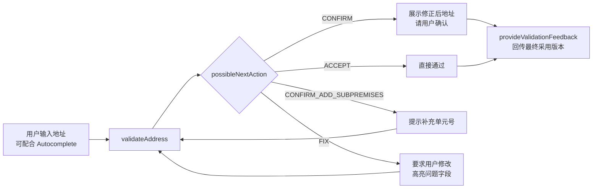

# 01 · Google Address Validation API 能力拆解

> 目的：搞清楚"对标对象"到底是什么，把它拆成可以逐项比较、逐项实现的能力清单。
> 信息基于 Google 官方文档与公开资料（截至 2026 年），**价格与覆盖国家变化较快，立项前请以官方页面为准**：
> [Overview](https://developers.google.com/maps/documentation/address-validation/overview) ·
> [Coverage](https://developers.google.com/maps/documentation/address-validation/coverage) ·
> [Usage & Billing](https://developers.google.com/maps/documentation/address-validation/usage-and-billing) ·
> [Build validation logic](https://developers.google.com/maps/documentation/address-validation/build-validation-logic)

---

## 1. AV 和 Geocoding 的本质区别

| 维度 | Geocoding（你们已有） | Address Validation（要新建） |
|---|---|---|
| 核心问题 | 这个地址**在哪**？ | 这个地址**对不对、全不全、能否送达**？ |
| 面对错误输入 | 尽量容错，返回"最可能"的点 | 必须**明确指出**哪个部分不对，并给出修正或追问 |
| 输出重点 | 坐标 + 格式化地址 | **结论（下一步动作）** + 逐组件可信度 + 修正标记 + 标准化地址 + 坐标 |
| 数据要求 | 路网 + 门牌插值基本够用 | 需要**存在性数据**：这个门牌 / 楼栋 / 单元是否真实存在 |
| 客户关心的指标 | 定位精度（米） | **误收率**（坏地址被放过 → 退件）与**误拒率**（好地址被拦 → 结账流失） |
| 典型场景 | 地图搜索、打点、路径规划 | 电商结账、物流下单、KYC 开户、CRM 数据清洗 |

**关键洞察：** Geocoder 把 "999 Bayfront Avenue" 插值到 Bayfront Avenue 上某个点，对 Geocoding 来说是"成功"；对 AV 来说，这是一次**误收**——因为 999 号不存在。AV 必须知道"不存在"。

---

## 2. 接口与数据结构

### 2.1 接口

| 接口 | 作用 |
|---|---|
| `POST v1:validateAddress` | 校验单个地址（**一次只能一个，无原生批量接口**） |
| `POST v1:provideValidationFeedback` | 客户回传"最终用了哪个版本"，用于 Google 改进 |

### 2.2 请求（Request）

| 字段 | 说明 |
|---|---|
| `address` | `PostalAddress` 结构：`regionCode`（国家，强烈建议传）、`languageCode`、`postalCode`、`administrativeArea`、`locality`、`sublocality`、`addressLines[]`、`organization`、`recipients[]` |
| `previousResponseId` | 同一地址多轮校验时串联（用户改了地址再次提交） |
| `enableUspsCass` | 仅美国 / 波多黎各，启用 USPS CASS 认证处理 |
| `sessionToken` | 与 Places Autocomplete 会话串联（影响计费 SKU） |
| `languageOptions` | 如 `returnEnglishLatinAddress`：额外返回英文 / 拉丁化地址（预览功能） |

### 2.3 响应（Response）：五大块

```
result
├── verdict                ← ★ 总体结论（最重要，决定客户端下一步做什么）
├── address                ← 标准化地址 + 逐组件判定
├── geocode                ← 坐标、PlaceID、Plus Code、要素尺寸
├── metadata               ← 住宅 / 商业 / 邮政信箱（仅部分国家）
├── uspsData               ← 美国 USPS CASS 数据（仅美国/波多黎各）
└── englishLatinAddress    ← 拉丁化地址（预览）
responseId                 ← 用于反馈和多轮串联
```

#### (1) `verdict` — 总体结论

| 字段 | 含义 |
|---|---|
| `inputGranularity` | 用户**输入**的地址精细到哪一级 |
| `validationGranularity` | 系统**能确认**到哪一级 |
| `geocodeGranularity` | 坐标精细到哪一级 |
| `addressComplete` | 地址是否完整（无缺失、无无法解析的 token、无可疑组件） |
| `hasUnconfirmedComponents` | 是否存在无法确认的组件 |
| `hasInferredComponents` | 是否**补全**了用户没填的组件（如根据街道推断邮编） |
| `hasReplacedComponents` | 是否**替换**了用户填错的组件 |
| `hasSpellCorrectedComponents` | 是否做了拼写纠正 |
| `possibleNextAction` | ★ 建议的下一步动作：`ACCEPT` / `CONFIRM` / `FIX` / `CONFIRM_ADD_SUBPREMISES` |

**Granularity（粒度）枚举**，从细到粗：

| 值 | 含义 |
|---|---|
| `SUB_PREMISE` | 楼内单元级（公寓号、#楼层-单元） |
| `PREMISE` | 楼栋 / 门牌级 |
| `PREMISE_PROXIMITY` | 近似门牌级（插值得到） |
| `BLOCK` | 街区级（日本等街区编址国家） |
| `ROUTE` | 道路级 |
| `OTHER` | 更粗（城市、邮编区等） |

**possibleNextAction（下一步动作）**——这是 Google AV 对客户最有价值的"一句话结论"：

| 值 | 含义 | 客户端典型处理 |
|---|---|---|
| `ACCEPT` | 地址可信 | 直接通过 |
| `CONFIRM` | 基本可信，但做了补全/纠正，或有低风险不确定项 | 弹窗"您是指 XXX 吗？" |
| `CONFIRM_ADD_SUBPREMISES` | 楼栋正确，但缺单元号（主要在美国能判断） | 提示"请补充单元号" |
| `FIX` | 有明显问题（缺关键组件、组件可疑、无法确认门牌等） | 要求用户修改 |

#### (2) `address` — 标准化地址 + 逐组件判定

| 字段 | 含义 |
|---|---|
| `formattedAddress` | 按当地邮政格式输出的标准地址 |
| `postalAddress` | 结构化的标准地址 |
| `addressComponents[]` | ★ **逐组件**判定（见下表） |
| `missingComponentTypes[]` | 按该国规则应有但缺失的组件类型 |
| `unconfirmedComponentTypes[]` | 无法确认的组件类型 |
| `unresolvedTokens[]` | 无法解析的输入片段 |

每个 `addressComponent` 包含：

| 字段 | 含义 |
|---|---|
| `componentName.text` / `languageCode` | 组件值 |
| `componentType` | 类型（street_number、route、locality、postal_code、subpremise……） |
| `confirmationLevel` | `CONFIRMED`（已确认存在且一致）/ `UNCONFIRMED_BUT_PLAUSIBLE`（无法确认但合理）/ `UNCONFIRMED_AND_SUSPICIOUS`（可疑，很可能错） |
| `inferred` | 是否为系统补全 |
| `spellCorrected` | 是否拼写纠正 |
| `replaced` | 是否被替换（用户填的值被认为是错的） |
| `unexpected` | 该国地址中不应出现的组件 |

> 三档 confirmationLevel 是整个产品的灵魂：它把"不知道"（PLAUSIBLE）和"知道是错的"（SUSPICIOUS）区分开。
> 要做到这一点，你需要知道**你的参考数据在这个区域有多全**——数据不全时说"可疑"就会误伤好地址。

#### (3) `geocode`

`location`（经纬度）、`plusCode`、`bounds`、`featureSizeMeters`（要素尺寸，衡量点的精确程度）、`placeId`、`placeTypes`。

#### (4) `metadata`

`residential`（住宅）、`business`（商业）、`poBox`（邮政信箱）。**仅在部分国家返回**（如马来西亚；并非所有覆盖国都有，具体名单见官方 Coverage 页面），可能为空。

#### (5) `uspsData`

美国专属：USPS 标准化地址、DPV 投递点确认码、CMRA、空置标记等。东南亚无对应物——但这提示我们：**"与当地邮政权威数据打通"是 AV 在单一国家做到极致的方式**。

---

## 3. 典型集成流程（Google 推荐的做法）



---

## 4. 覆盖、配额与价格

| 项目 | 信息（以官方为准） |
|---|---|
| 覆盖国家 | 约 39 个国家/地区（含 GA 与预览） |
| 东南亚 / 亚洲 | **新加坡、马来西亚：GA**；日本、印度：预览；**印尼、泰国、越南、菲律宾：未覆盖** |
| 单元号校验 | 缺失 / 错误的单元号判断基本**仅限美国** |
| 批量 | **无原生批量接口**，需客户自行并发调用；官方另有"高并发校验"架构指南 |
| 限流 | 默认约 6,000 QPM |
| 价格 | Pro SKU 约 **$17 / 1,000 次**，每月前 **5,000 次免费**，量大阶梯降价（百万级以上显著下降）；与 Autocomplete 会话打包的属于 Enterprise SKU |
| 数据使用 | 受 Google Maps Platform 服务条款约束，对**预取、存储、索引、缓存**结果有严格限制 |

---

## 5. Google AV 的弱点 = 我们的机会

| # | Google 的弱点 | 对我们意味着什么 |
|---|---|---|
| 1 | **东南亚覆盖空白**：印尼、泰国、越南、菲律宾未覆盖 | 这是最直接的市场空档，也是本地地图厂商的天然优势 |
| 2 | **美国以外几乎不做单元级校验** | 新加坡 HDB / 公寓的 `#楼层-单元` 是高频刚需，做到单元级即形成差异 |
| 3 | **metadata 覆盖有限** | 住宅 / 商业 / 楼宇类型（HDB、Condo、商场、工业大厦）对物流定价、风控很有用 |
| 4 | **无批量接口 + 缓存限制** | 企业做 CRM / 主数据清洗时非常痛；我们可以提供批量任务 + 允许存储结果 |
| 5 | **坐标以楼栋为目标，不以"入口 / 投递点 / 上车点"为目标** | 对外卖、即时配送、网约车而言，入口点比楼中心更有价值 |
| 6 | **本地化长尾**：地标式地址、多语言混写、行政区划变更（如越南 2025 年撤县并省） | 本地团队 + 本地数据更容易做好 |
| 7 | **价格高**，且计费和条款对大客户不友好 | 价格 / 私有化部署 / 数据驻留是商务杠杆 |
| 8 | **判定过程不透明**，只给结论，不给原因码 | 提供可解释的 reason codes，便于客户做规则、客服解释 |

> ⚠️ 也要清醒看到 Google 的强项：全球统一 schema、与 Places Autocomplete 的无缝组合、品牌信任、对海量用户行为数据的利用。**在新加坡正面硬刚"通用地址校验"难度较高，差异化要落在"更深（单元级 / 入口点）+ 更广（Google 未覆盖国家）+ 更灵活（批量 / 条款 / 部署）"上。**
