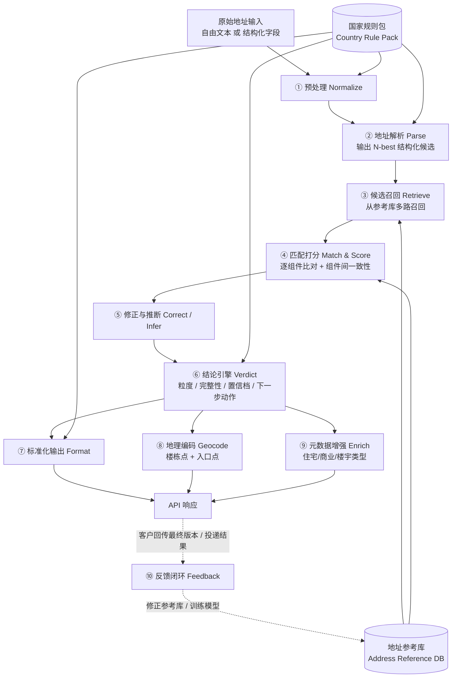

# 02 · 能力架构与技术拆解

> 目的：把"做一个 Address Validation"拆成可分工、可排期的模块，并明确哪些能复用现有 Geo 能力、哪些必须新建。

---

## 1. 总体处理流水线



两个**核心资产**贯穿全流程：

- **地址参考库（Address Reference DB）**：你认为"真实存在"的地址集合，带来源、时效、置信度。详见 [03 数据策略](03-data-strategy-sea.md)。
- **国家规则包（Country Rule Pack）**：每个国家一套配置——地址由哪些组件构成、哪些必填、邮编格式和语义、缩写词典、输出格式模板。这是"加一个国家"时的主要工作量。

---

## 2. 各模块说明

### ① 预处理 Normalize

- Unicode 规范化、全半角、大小写、多余标点与空白
- **缩写展开 / 别名归一**：`Blk → Block`、`Ave/Av → Avenue`、`Jln/Jl. → Jalan`、`Tmn → Taman`、`Kg → Kampung`、`Gg. → Gang`、`Sq → Square`
- 语言 / 文字检测（中英马泰越混写常见）、必要时音译
- 识别并剥离非地址信息：收件人、电话、"请放门口"之类备注

> 复用：现有 Geo 检索通常已有部分归一化逻辑，可直接沿用并扩展词典。

### ② 地址解析 Parse

把自由文本切成结构化组件：`门牌 / 楼栋号`、`单元 / 楼层`、`楼宇名`、`街道`、`小区 / 住宅区（Taman / Perumahan）`、`区 / 乡镇`、`市`、`州 / 省`、`邮编`。

| 方案 | 优点 | 缺点 | 建议用法 |
|---|---|---|---|
| 规则 + 正则 | 快、可控、可解释 | 长尾差、维护成本高 | 邮编、单元号（`#05-12`）等强格式组件 |
| 序列标注模型（CRF / 小型 Transformer） | 准确率高、延迟低 | 需要标注数据 | **主力方案**，热路径使用 |
| 开源 [libpostal](https://github.com/openvenues/libpostal)（MIT） | 开箱即用、多语言 | 东南亚长尾一般 | 快速 baseline / 冷启动 |
| 大语言模型（LLM） | 长尾、非正式地址理解强 | 延迟和成本高、输出需约束 | **离线**生成训练数据、标注辅助；热路径仅作兜底 |

**关键要求：输出 N-best 候选 + 置信度**，而不是一个"最好的"解析。例如 "123 Jalan 1" 里的 `123` 可能是门牌号，也可能是 Taman 编号，需要交给下游用参考库裁决。

> 复用：现有 Geo 如果有 parser，这是最大的可复用点；需要确认它能否输出 N-best 和逐组件置信度。

### ③ 候选召回 Retrieve

- 多路召回：按**邮编**、**街道 + 门牌**、**楼宇名**、**行政区 + 住宅区名**、模糊文本分别召回，再合并
- 新加坡可以"邮编优先"（邮编≈楼栋）；马来西亚必须"住宅区 + 邮编"联合（同名街道 `Jalan 1/2` 大量重复）

> 复用：现有 Geo 的检索索引可以直接复用，但需要把"召回的对象"从"可定位的点"扩展到"参考库中的地址实体"。

### ④ 匹配打分 Match & Score

对每个候选：

1. **逐组件比对**：编辑距离、音近、别名表、缩写、数字格式（`5` vs `05`）
2. **组件间一致性**：邮编 ↔ 街道 ↔ 区 ↔ 州是否互相吻合；门牌号是否在该街道的合法区间 / 集合内
3. **存在性判断**：该门牌 / 楼栋 / 单元在参考库中是否存在
4. **区域数据完整度加权**：参考库在该区域越完整，"查不到"越能说明"不存在"；不完整时只能判"无法确认"

> 这一步是"Geocoding → Validation"跨越的核心，**需要新建**。
> 初期用可解释的规则 + 加权打分，积累评测数据后再上学习排序（Learning to Rank）模型并做置信度校准。

### ⑤ 修正与推断 Correct / Infer

对应 Google 的四个标记：

| 行为 | 示例 | 对应标记 |
|---|---|---|
| 拼写纠正 | `Bayfrnt Ave` → `Bayfront Avenue` | `spellCorrected` |
| 补全缺失组件 | 新加坡只填了 "1 Raffles Place" → 补全邮编 | `inferred` |
| 替换冲突组件 | 街道 + 门牌可信，但邮编明显属于别处 → 替换邮编 | `replaced` |
| 标记无法解析 | 输入里有无法归类的片段 | `unresolvedTokens` |

**原则：补全可以积极，替换必须保守。** 替换用户输入意味着"我比用户更懂他家在哪"，错了代价很大。需要设置"替换的最低置信阈值"并用评测集校准。

### ⑥ 结论引擎 Verdict

输入：最佳候选 + 各组件判定 + 国家规则包；输出：`granularity`、`addressComplete`、逐组件 `confirmationLevel`、`possibleNextAction`、**reason codes**（差异化，见 05 文档）。

示意决策逻辑（新加坡，初版规则）：

```
if 缺少关键组件（邮编且无法推断 / 门牌号）            -> FIX
elif 任一关键组件 UNCONFIRMED_AND_SUSPICIOUS         -> FIX
elif 验证粒度 < PREMISE                               -> FIX
elif 楼栋为住宅多单元楼（HDB / Condo）且缺单元号       -> CONFIRM_ADD_SUBPREMISES
elif 有 replaced 组件                                 -> CONFIRM
elif 有 inferred / spellCorrected 组件                -> CONFIRM（可按客户配置降为 ACCEPT）
elif 单元号 UNCONFIRMED_BUT_PLAUSIBLE                 -> CONFIRM（或 ACCEPT，取决于严格度档位）
else                                                  -> ACCEPT
```

**可配置严格度（Strictness Profile）**：不同客户对误收 / 误拒的容忍度不同——

| 档位 | 适用客户 | 倾向 |
|---|---|---|
| Strict | 金融 KYC、高价值物流 | 宁可误拒，不可误收 |
| Balanced（默认） | 一般物流、电商 | 平衡 |
| Lenient | 电商结账（转化优先） | 宁可误收，不可误拒 |

> Google 只给一个固定结论，客户要在自己代码里二次加工；**让客户直接选档位，是一个低成本的差异化点**。

### ⑦ 标准化输出 Format

- 按国家邮政格式输出（参考 UPU 地址格式、Google 开源的 [libaddressinput](https://github.com/google/libaddressinput) 地址元数据，Apache 2.0）
- 同时返回本地语言版本和拉丁化 / 英文版本
- 越南等存在行政区划调整的国家：**接受旧地址输入，输出新标准地址**，并返回新旧对照

### ⑧ 地理编码 Geocode

- 复用现有 Geocoding，输出楼栋点 + `featureSizeMeters`
- **差异化**：返回**入口点 / 投递点 / 上车点**（来自配送签收、司机上车点等行为数据）

### ⑨ 元数据增强 Enrich

- 住宅 / 商业 / 工业 / 混合；楼宇类型（新加坡 HDB、Condo、Landed、商场、写字楼）
- 数据来源：POI、楼宇属性、政府开放数据（如新加坡 HDB 楼栋数据集）

### ⑩ 反馈闭环 Feedback

- **API 层反馈**：客户最终采用了"原始版本 / 修正版本 / 未使用"（对标 `provideValidationFeedback`）
- **业务层反馈**（更有价值）：投递成功 / 失败、签收坐标、改派记录——需要与物流 / 电商客户建立数据合作
- 反馈进入：参考库修正（新增 / 下线地址）、模型训练样本、评测集扩充

---

## 3. 现有 Geo 能力的复用评估

| 模块 | 复用程度 | 需要补齐的能力 |
|---|---|---|
| ① 预处理 | 高 | 东南亚缩写词典、备注剥离 |
| ② 解析 | 中–高 | N-best 输出、逐组件置信度、单元号解析 |
| ③ 召回 | 中–高 | 召回对象从"点"扩展到"参考库地址实体" |
| ④ 匹配打分 | 低 | **新建**：存在性、一致性、完整度加权 |
| ⑤ 修正推断 | 低–中 | **新建**：显式标记 inferred / replaced / spellCorrected |
| ⑥ 结论引擎 | 无 | **新建**：规则引擎 + 严格度档位 + reason codes |
| ⑦ 标准化输出 | 中 | 国家格式模板、多语言 / 拉丁化 |
| ⑧ 地理编码 | 高 | 入口点 / 投递点（可后置） |
| ⑨ 元数据 | 中 | 楼宇类型映射 |
| ⑩ 反馈闭环 | 无 | **新建** |
| 参考库 | 中 | **存在性语义**、来源追溯、区域完整度度量 |
| 国家规则包 | 低 | **新建**，每国一套 |

**结论：** 最大的新建工作在 ④⑥⑩ 和"参考库的存在性语义"，这也是 AV 与 Geocoding 的本质差别。

---

## 4. 非功能性要求（建议初始目标）

| 项目 | 建议目标 | 说明 |
|---|---|---|
| 单条延迟 | P95 ≤ 200ms，P99 ≤ 400ms | 结账场景要求实时；LLM 不应进入常规热路径 |
| 可用性 | 99.9% | 结账和下单链路依赖 |
| 吞吐 | 单租户 ≥ 100 QPS 起 | 对标 Google 默认约 6,000 QPM |
| 批量 | 百万级 / 小时 | 企业数据清洗 |
| 可观测性 | 按国家 × 结论 × 严格度的实时分布监控 | 结论分布突变往往是数据或模型出问题的第一信号 |
| 版本化 | 参考库、规则包、模型分别版本化 | 结论变化需可追溯（"为什么昨天 ACCEPT 今天 FIX"） |
