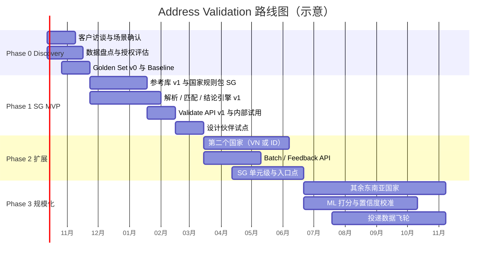

# 05 · PRD 骨架与路线图

> 目的：给出可以直接拿去立项评审的 PRD 骨架——目标客户、产品形态、API 设计、差异化、定价、分阶段计划、团队、风险与待决策项。
> 方括号 `[ ]` 处需要你们根据内部情况填写。

---

## 1. 背景与目标

- **背景**：公司已有 Geo 能力（地理编码 / 检索），客户在结账、下单、开户、数据清洗等场景有"判断地址对不对"的需求，目前只能用 Google AV 或自建规则。Google AV 在东南亚多国未覆盖，且价格高、条款严。
- **目标**：打造覆盖东南亚、在新加坡达到单元级精度的 Address Validation 能力，成为 [公司名] 地图平台的新收入线，并与现有 Geocoding / Autocomplete 形成组合销售。
- **一年期目标（示例，待校准）**：
  - 覆盖 [3–6] 个东南亚国家，其中新加坡关键指标不劣于 Google，至少一个 Google 未覆盖国家达到可商用水平
  - 签约 [N] 家付费客户，其中 [M] 家为物流 / 电商头部客户
  - 设计伙伴投递失败率下降 [X]%

---

## 2. 目标客户与场景

| 优先级 | 客户类型 | 场景 | 调用方式 | 最在意 | 严格度倾向 |
|---|---|---|---|---|---|
| P0 | 物流 / 快递 | 下单时校验、揽派前清洗、分拣 | 实时 + 批量 | 投递成功率、入口点 | Balanced / Strict |
| P0 | 电商平台 | 结账地址校验 | 实时（配合 Autocomplete） | 转化率不下降 + 退件减少 | Lenient / Balanced |
| P1 | 外卖 / 即时配送 / 网约车 | 下单地址 → 精确入口 / 上车点 | 实时 | 入口点精度、延迟 | Balanced |
| P1 | 金融 / 电信 / 保险 | KYC 开户地址核验 | 实时 | 真实性、可审计（原因码） | Strict |
| P2 | 企业 CRM / 主数据 | 存量地址库清洗、去重、标准化 | 批量 | 批量能力、可存储结果、价格 | 可配置 |
| P2 | 政府 / 公共事业 | 登记、普查、应急 | 批量 + 私有化 | 数据驻留、私有化部署 | Strict |

> **建议首批聚焦 P0：物流 + 电商。** 它们调用量大、ROI 可量化（退件成本是真金白银），且往往能提供投递结果回流，形成数据飞轮。

---

## 3. 产品形态

| 形态 | 说明 | 阶段 |
|---|---|---|
| **Validate API**（单条实时） | 核心能力 | MVP |
| **Batch API**（异步批量任务） | 上传文件 / 提交任务 → 回调或轮询取结果；附清洗报告 | Phase 2 |
| **Feedback API** | 回传最终采用版本、投递结果 | Phase 2 |
| **Autocomplete + Validate 组合** | 与现有 Autocomplete 打通，同一会话计费 | Phase 2 |
| **前端组件 / SDK** | 即插即用的结账地址表单（建议、确认弹窗、单元号提示） | Phase 3 |
| **控制台** | 批量上传、清洗报告、用量与结论分布看板 | Phase 2–3 |
| **私有化 / 数据驻留** | 面向政府、金融 | 按需 |

---

## 4. API 设计

### 4.1 设计原则

1. **概念对齐 Google，降低迁移成本**：沿用 verdict / granularity / confirmationLevel / possibleNextAction 等概念与语义，并提供"Google → 我方"字段映射迁移文档。*（具体兼容程度请法务确认）*
2. **在对齐的基础上做增量扩展**，扩展字段集中、清晰标注。
3. **可解释**：每个结论都附原因码。
4. **可配置**：严格度档位、返回内容开关。

### 4.2 端点草案

| 方法 | 路径 | 说明 |
|---|---|---|
| POST | `/v1/address:validate` | 单条校验 |
| POST | `/v1/address:batchValidate` | 创建批量任务，返回 `jobId` |
| GET | `/v1/jobs/{jobId}` | 查询批量任务状态与结果下载地址 |
| POST | `/v1/address:feedback` | 回传最终采用版本 / 投递结果 |

### 4.3 相比 Google 的扩展字段

| 字段 | 说明 | 价值 |
|---|---|---|
| 请求 `strictness` | `STRICT` / `BALANCED` / `LENIENT` | 客户无需自己二次加工结论 |
| `verdict.reasons[]` | 原因码 + 涉及组件 + 可读说明 | 可解释、便于客户做规则和客服解释 |
| `verdict.confidence` | 0–1 置信度（经校准） | 客户可自定义阈值 |
| `candidates[]` | 存在歧义时返回 Top-N 候选 | 让用户点选，而不是直接 FIX（Google 不返回备选） |
| `address.adminMapping` | 旧行政区划 → 新行政区划对照 | 越南等改革国家的刚需 |
| `geocode.entrances[]` | 入口 / 投递点 / 上车点 | 配送与出行场景 |
| `metadata.buildingType` | HDB / Condo / Landed / 商场 / 写字楼 / 工业 | 物流定价、风控 |
| 本地语言 + 拉丁化双输出 | 同时返回 | 跨境与本地系统都能用 |

完整示例（新加坡 HDB 地址）：[`templates/api-response-example-sg.json`](../templates/api-response-example-sg.json)

### 4.4 原因码（Reason Codes）初版清单

| 原因码 | 含义 | 典型结论 |
|---|---|---|
| `POSTCODE_INFERRED` | 邮编由系统推断补全 | CONFIRM |
| `STREET_SPELL_CORRECTED` | 街道名拼写纠正 | CONFIRM |
| `POSTCODE_STREET_MISMATCH` | 邮编与街道 / 门牌不一致 | CONFIRM（可修正）/ FIX |
| `PREMISE_NOT_FOUND` | 门牌 / 楼栋在高完整度区域中不存在 | FIX |
| `PREMISE_UNVERIFIED_LOW_COVERAGE` | 门牌查不到，但该区域数据完整度低 | CONFIRM |
| `UNIT_MISSING_MULTI_UNIT_BUILDING` | 多单元住宅楼缺单元号 | CONFIRM_ADD_SUBPREMISES |
| `UNIT_FLOOR_EXCEEDS_BUILDING` | 单元楼层超出楼栋最高层 | FIX |
| `ADMIN_AREA_RENAMED` | 使用了旧行政区划 / 旧街道名 | CONFIRM |
| `AMBIGUOUS_MULTIPLE_CANDIDATES` | 多个候选无法区分 | FIX（附 candidates） |
| `POI_ONLY_NO_PREMISE` | 仅能定位到 POI / 地标 | 按规则包 |
| `UNRESOLVED_TOKENS` | 存在无法解析的输入片段 | CONFIRM / FIX |
| `MISSING_REQUIRED_COMPONENT` | 缺少该国必需组件 | FIX |

---

## 5. 差异化定位

> **定位陈述（草案）：**
> 面向东南亚的物流与电商企业，[产品名] 是**最懂东南亚地址**的地址校验服务：覆盖 Google 未覆盖的市场，在新加坡做到单元级与入口级，并以批量、可解释和灵活的商业条款帮助企业减少退件、提升转化。

| 维度 | Google AV | 我们（目标） |
|---|---|---|
| 东南亚覆盖 | SG / MY | SG / MY + **ID / TH / VN / PH** |
| 单元级 | 基本仅美国 | **新加坡 HDB / Condo 单元级** |
| 坐标 | 楼栋点 | 楼栋点 + **入口 / 投递点** |
| 本地化 | 通用 | 地标式地址、多语混写、**行政区划变更映射** |
| 可解释 | 仅结论 | **原因码 + 置信度 + 候选** |
| 批量 | 无原生批量 | **原生批量 + 清洗报告** |
| 严格度 | 固定 | **可配置档位** |
| 商务 | 标准价、严格缓存条款 | 更有竞争力的价格、允许存储结果、私有化 |

---

## 6. 商业模式与定价思路

- **按调用计费 + 阶梯价**，锚定 Google（Pro 约 $17 / 1,000 次，每月前 5,000 次免费），目标价 [Google 的 X%]
- **批量更便宜**（异步、可错峰，成本低）
- **组合包**：Autocomplete + Validate + Geocoding 打包，提升客单价和粘性
- **数据换价格**：客户回传投递结果可享折扣——既降客户成本，又喂养数据飞轮
- **企业版**：私有化 / 数据驻留 / SLA 加价

> 定价前需算清**单位成本**：计算资源 + 数据授权分摊（邮政数据往往按量或按年收费）+ 运营（数据更新、标注）。

---

## 7. 分阶段路线图

> 以 6–10 人团队估算，时间仅供参考，请按实际资源调整。

| 阶段 | 时长 | 关键交付 | 退出标准 |
|---|---|---|---|
| **Phase 0 · Discovery** | 约 6 周 | 客户访谈报告（≥ 10 家）；数据盘点表（L0–L7 × 国家）；数据授权评估；SG Golden Set v0（500 条）；Google / 现有 Geocoder baseline 报告；立项文档 | 明确首发国家、目标客户、数据方案；管理层批准立项 |
| **Phase 1 · SG MVP** | 约 3 个月 | SG 参考库 v1（楼栋级）；SG 规则包；解析 / 匹配 / 结论引擎 v1（规则为主）；Validate API v1；严格度档位；原因码 | SG 关键指标达到 04 文档 MVP 门槛；1–2 家设计伙伴上线试点 |
| **Phase 2 · 扩展** | 约 3 个月 | 第二个国家（优先 Google 未覆盖者）；Batch API + 清洗报告；Feedback API；SG 单元级；入口点 v1；控制台 v1 | 第二国家可商用；首批付费客户签约 |
| **Phase 3 · 规模化** | 6 个月+ | 其余东南亚国家；学习排序与置信度校准；投递数据飞轮；前端组件 / SDK；地标式地址 | 覆盖 [N] 国；付费客户 [M] 家；设计伙伴投递失败率下降 [X]% |

---

## 8. 团队配置建议

| 角色 | 人数 | 职责 |
|---|---|---|
| 产品经理 | 1 | 需求、评测体系 owner、客户与设计伙伴、定价 |
| 技术负责人 | 1 | 架构、与现有 Geo 团队的复用边界 |
| 后端工程师 | 2 | API、批量、规则引擎、性能 |
| NLP / ML 工程师 | 1–2 | 解析模型、匹配打分、置信度校准 |
| 数据工程师 | 2 | 参考库管线、多源融合、许可证隔离、完整度计算 |
| GIS 数据运营 / 标注 | 1–2（可外包扩充） | Golden Set 标注、实地核验、数据质检 |
| 商务拓展（兼） | — | 数据授权谈判、设计伙伴与数据合作 |
| 法务（支持） | — | 数据授权、ODbL、Google ToS、PDPA |

---

## 9. 主要风险与应对

| 风险 | 影响 | 应对 |
|---|---|---|
| 权威数据授权谈不下来 / 太贵 | 无法达到门牌级存在性 | 早启动 BD；以行为数据 + 开放数据 + 合作数据兜底；按国家分级承诺能力 |
| OSM 等 share-alike 数据"污染"自有库 | 法律与商业风险 | 许可证标签 + 存储隔离；法务前置评审 |
| 对比测试或数据使用触碰 Google ToS | 法律风险 | 仅保留聚合指标；真值独立来源；法务把关 |
| 数据完整度不足导致大面积误拒 | 客户体验差、流失 | 区域完整度加权；低完整度区域默认保守到 CONFIRM；覆盖热力图透明化 |
| 错误修正（把对的改成错的） | 比不修正更糟 | 替换设高阈值；修正准确率作为发布硬门槛 |
| 延迟不达标（如过度依赖 LLM） | 结账场景不可用 | LLM 离线化；热路径用轻量模型；延迟预算分解到模块 |
| 行政区划 / 城市快速变化 | 数据过时 | 每国更新 SLA；监控新地址出现速度；行为数据发现新地址 |
| 个人数据合规（PDPA 等） | 合作数据无法使用 | 脱敏、目的限定、数据处理协议；隐私评审 |

---

## 10. 需要管理层拍板的决策

1. **首发国家组合**：新加坡 + [越南 / 印尼 / 马来西亚]？
2. **首批目标客户**：物流 + 电商？是否已有可做设计伙伴的客户？
3. **API 是否对齐 Google 语义**（迁移友好） vs 完全自有设计？
4. **数据采购预算**：邮政 / 权威数据授权的年度预算上限？
5. **定价定位**：低价抢量 vs 同价更优？
6. **是否提供私有化部署**？
7. **团队**：独立团队 vs 依托现有 Geo 团队扩编？

---

## 11. 成功指标

| 层级 | 指标 |
|---|---|
| 北极星 | 客户侧**因地址导致的投递失败率**下降幅度 |
| 质量 | FAR / FRR / 修正准确率 / PREMISE 与 SUB_PREMISE 覆盖率（按国家） |
| 采用 | 付费客户数、调用量、"采用修正版本"比例 |
| 商业 | ARR、单位调用毛利、组合销售比例 |
| 数据飞轮 | 回流投递结果的客户占比、每月新增 / 修正的参考库地址数 |
