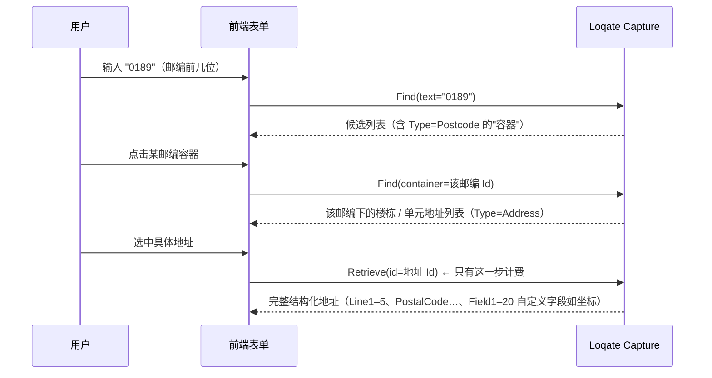

# 06 · 竞品拆解：Loqate（GBG）——验真 + 补齐

> 目的：拆解第二个对标对象 Loqate。它和 Google 的出发点不同：Google 是"地图公司做地址"，Loqate 是"数据质量 / 身份核验公司做地址"。两者放在一起看，才能找准我们的位置。
> 信息基于 Loqate 官方文档与公开报道（截至 2026 年），**价格、覆盖和合作进展以官方为准**：
> [Address Verify 概览](https://docs.loqate.com/our-services/address-verify/overview) ·
> [Address Capture 概览](https://docs.loqate.com/our-services/address-capture/overview) ·
> [AVC 说明](https://docs.loqate.com/report-codes/address-verification-code) ·
> [AQI 说明](https://docs.loqate.com/report-codes/address-quality-index) ·
> [全球覆盖](https://www.loqate.com/en-gb/global-coverage/)

---

## 1. Loqate 是谁

| 项目 | 信息 |
|---|---|
| 母公司 | GBG（GB Group plc，英国），主业是**身份核验、反欺诈、数据质量** |
| 定位 | 全球地址校验与采集专家，**不是地图公司** |
| 规模（官方口径） | 日调用量 7,000 万次以上；覆盖 245+ 国家和地区、130+ 种地址格式、3,000+ 种语言、139 种文字 |
| 产品家族 | **Address Capture**（补齐）、**Address Verify**（验真）、地理编码 / 逆地理编码、邮箱验证、电话验证、门店查找等 |
| 部署 | 云 API；Verify 另有**私有化部署**（Kubernetes / Helm，可完全离线运行，可选 AI Parser 组件） |
| 分发 | 自助 credit 套餐 + 企业授权；电商插件（如 Shopify）；**被嵌入大量 MDM / 数据质量 / CRM 平台**（公开文档可见 IBM InfoSphere QualityStage、Precisely Spectrum、Talend、Reltio、Stibo 等都有 Loqate 集成） |

> **定位差异是理解 Loqate 的钥匙：** 它卖的是"数据质量"——客户是做结账、CRM 主数据、KYC 的团队，而不是做地图应用的团队。它的强项是**规则化、可审计、可批量、能私有化**，以及和身份核验产品的捆绑。

---

## 2. 补齐：Address Capture（在录入时就拿到正确地址）

**思路：与其事后校验，不如在用户输入时就让他选中一个"已知正确"的地址。**

### 2.1 Find / Retrieve 两步式交互



| 机制 | 说明 | 对我们的启发 |
|---|---|---|
| **Find** | 边输边搜，返回候选；候选可能是"容器"（邮编、街道、楼栋） | — |
| **容器下钻（Container drill-down）** | 选中邮编 / 街道 / 楼栋后继续 Find，逐级展开到具体地址 | **新加坡"邮编 → 楼栋 → 单元"天然适合这种交互**，能从源头消灭缺单元号问题 |
| **Retrieve** | 取回完整、标准化的结构化地址 | — |
| **位置偏置** | 根据调用方 IP 优先返回附近地址（中间件调用可关闭：`IsMiddleware`） | 我们有地图和定位能力，可做得更好（GPS / 当前城市） |
| **自定义字段 Field1–20** | 可配置在 Retrieve 中返回坐标等额外数据 | 可返回入口点、楼宇类型等差异化字段 |
| **计费** | 仅在用户选中地址（Retrieve）时扣费，Find 不计费 | 计费模型对客户友好，值得参考 |

### 2.2 与 Google 的对应关系

| 能力 | Google | Loqate |
|---|---|---|
| 边输边补齐 | Places Autocomplete（地点 + 地址混合） | Address Capture（**只做地址**，支持容器下钻） |
| 补齐后校验 | Autocomplete 会话 + Address Validation（Enterprise SKU） | Capture + Verify |

---

## 3. 验真：Address Verify（对已有地址做校验、纠错、补全、标准化）

| 项目 | 说明 |
|---|---|
| 接口 | `Cleansing/International/Batch`：**同一个接口既支持单条实时，也支持一次提交多条**（原生批量） |
| 处理 | 解析 → 与参考数据匹配 → 纠错 / 补全 → 标准化输出 → 可选地理编码 |
| 输出 | 标准化地址（多行 + 结构化组件）、**AVC**（校验码）、**AQI**（质量等级）、坐标 + **GeoAccuracy**（地理编码精度码） |
| 认证数据集 | 支持邮政认证流程，如美国 CASS、加拿大 SERP、澳大利亚 AMAS |
| 增强数据集 | 部分国家提供付费"增强"数据（如更深的门牌级数据） |
| 多语言 | 支持音译 / 指定输出文字系统（本地文字或拉丁文） |
| 部署 | 云 API，或私有化（Kubernetes / Helm，地址校验全流程不需要联网） |

---

## 4. 核心：Loqate 如何表达"校验结果"

Google 用一组语义化 JSON 字段 + 一个"下一步动作"表达结论；Loqate 则用一串**紧凑的编码**。

### 4.1 AVC（Address Verification Code）

示例：**`V44-I44-P6-100`**，由 8 个部分组成：

```
 V   4   4  -  I   4   4  -  P6  -  100
 │   │   │     │   │   │     │      └─ ⑧ Matchscore：输入与输出的相似度（100 = 未改动）
 │   │   │     │   │   │     └──────── ⑦ 邮编状态（P0–P8）
 │   │   │     │   │   └────────────── ⑥ 上下文识别级别（0–5）
 │   │   │     │   └────────────────── ⑤ 词典识别级别（0–5）
 │   │   │     └────────────────────── ④ 解析状态
 │   │   └──────────────────────────── ③ 处理前匹配级别（0–5）
 │   └──────────────────────────────── ② 处理后匹配级别（0–5）
 └──────────────────────────────────── ① 校验状态
```

| 部分 | 取值 |
|---|---|
| ① 校验状态 | `V` 已验证（与唯一参考记录完全匹配）· `P` 部分验证 · `U` 未验证 · `A` 歧义（多个接近的候选）· `C` 冲突（多个候选且数据互相矛盾）· `R` 回退（未达到设定的最低校验级别，输出回退为输入） |
| ②③ 匹配级别 | `5` 投递点（单元 / 邮政信箱）· `4` 门牌 / 楼栋 · `3` 道路 · `2` 城镇 · `1` 行政区 · `0` 无 |
| ④ 解析状态 | `I` 已识别并解析 · `U` 无法解析 |
| ⑤⑥ 识别级别 | 输入内容通过词典 / 上下文被识别到哪一级（0–5） |
| ⑦ 邮编状态 | `P8` 主、次邮编均验证 · `P7` 主邮编验证、次邮编补充或修改 · `P6` 主邮编验证 · `P5` 主邮编验证但有小改动 · `P4` 主邮编验证但有大改动 · `P3` 主邮编由系统补充 · `P2` / `P1` 主邮编仅由词典 / 上下文识别 · `P0` 主邮编为空 |
| ⑧ Matchscore | 0–100，衡量为了达到校验结果改动了多少 |

**示例解读：** `V44-I44-P6-100` = 验证通过；处理前后都匹配到门牌级；输入被完整解析；主邮编验证通过；输入无需改动。

> **设计亮点："处理前 vs 处理后"匹配级别 + Matchscore。**
> 比如 `V54`（处理前 4、处理后 5）说明系统把地址从门牌级补齐到了单元级；`Matchscore=85` 说明改动不小。这让数据治理团队一眼看出**"补了什么、改了多少"**——这是做批量清洗、写审计报告时非常有用的信息。

### 4.2 AQI（Address Quality Index）

- `A`（优）→ `E`（差）五档，由**处理后匹配级别**和 **Matchscore** 两个因素决定。例如：匹配到门牌级且 Matchscore = 100 → `A`
- ⚠️ Loqate 官方明确说明：**AQI 用于整体质量概览，不建议直接作为接受 / 拒绝地址的依据**——也就是说，客户需要自己基于 AVC 写判断规则（官方为此提供了分国家的 AVC 解读教程）

### 4.3 GeoAccuracy（地理编码精度码）

两位：状态 + 级别。`P` 单点匹配 · `I` 插值 · `A` 多候选取平均 · `U` 无法编码；级别同上（4 门牌、3 道路、2 城镇、1 行政区）。
例：`P4` = 单点精确匹配到门牌（最好）；`I3` = 沿道路插值；`U0` = 无法编码。

### 4.4 两种表达方式对比

| 维度 | Google | Loqate |
|---|---|---|
| 表达形式 | 语义化 JSON 字段 | 紧凑编码（AVC / AQI / GeoAccuracy） |
| 导向 | **结论导向**：直接给 `possibleNextAction` | **过程导向**：告诉你匹配到哪级、改了多少、邮编怎么处理 |
| 逐组件判定 | 有（每个组件的 confirmationLevel 与 inferred / replaced / spellCorrected） | 以整体编码为主 |
| 改动幅度 | 布尔标记（有无补全 / 替换 / 纠错） | **Matchscore 0–100 + 处理前后级别** |
| 谁用得顺手 | 应用开发者（结账表单） | 数据治理团队（批量清洗、MDM、审计） |
| 客户要做的事 | 按动作分支即可 | **需自行基于 AVC 编写接受 / 拒绝规则** |

> **我们的设计可以两者兼得：** 结论导向的 `possibleNextAction` + 严格度档位（开发者友好），同时提供处理前后匹配级别、改动幅度评分和一个紧凑编码字段，方便批量 / MDM 场景直接写规则和出报表。

---

## 5. ⚠️ 东南亚最关键的动态：Loqate × GrabMaps

| 时间 | 进展（据公开报道） |
|---|---|
| 2024-10 | Loqate 与 GrabMaps 宣布战略合作，首先把 GrabMaps 的**马来西亚**地址数据接入 Loqate 平台，计划扩展至新加坡、泰国、菲律宾、印尼 |
| 2025 | 签署新协议，数据合作扩展到**新加坡、印尼、泰国、菲律宾、越南**；马来西亚数据覆盖全部 13 个州和 3 个联邦直辖区，官方称覆盖**超过 80% 的马来西亚家庭** |
| 数据体量 | GrabMaps 区域数据含 **6,500 万+ 地址与 POI**，覆盖新加坡、柬埔寨、越南、菲律宾、印尼、马来西亚、缅甸、泰国 |

**这对我们意味着什么：**

1. **"Google 在东南亚有空白"不再是无人竞争的机会。** Loqate 正在用"全球地址校验引擎 + GBG 的企业渠道 + 本地地图公司的数据"填补这个空白。在印尼、泰国、越南、菲律宾，真正的对手很可能是 Loqate，而不是 Google。
2. **它同时揭示了第二种商业模式：把本地数据授权给全球地址校验厂商。** "自营地址校验 API"和"向 Loqate 这类厂商供数据"并不互斥，但会有渠道冲突，需要管理层明确取舍（已加入 [05 文档](05-prd-and-roadmap.md) 的决策清单）。
3. **如果贵司与 GrabMaps 有关联，或本身就是 Loqate 的数据供应方**，Loqate 的角色会从"竞品"变成"渠道 / 客户"，需要结合合作协议的边界重新看整个方案。
4. **评测时必须重点测 Loqate 在东南亚的表现**，尤其是马来西亚（最早接入 GrabMaps 数据的市场）。

---

## 6. 定价与商业模式

| 项目 | 信息（以官方为准） |
|---|---|
| 模式 | **Credit 制**：预购 credit，按调用扣减，买得越多单价越低；credit 有效期 12 个月；也有月付 / 年付套餐和企业授权 |
| Capture 计费 | 只在用户**选中地址（Retrieve）**时计费 |
| 参考价 | 公开的一个套餐示例：€800 约可做 15,740 次查询（"其他国家"费率，约 €0.05 / 次）；大客户走企业合同 |
| 试用 | 提供免费试用 credit |

> 与 Google Pro SKU（约 $17 / 1,000 次，即约 $0.017 / 次）相比，Loqate 小套餐的单次价格更高，但企业合同、私有化授权和捆绑销售让实际价格差异很大。**对大客户的真实报价需要通过客户访谈了解。**

---

## 7. Loqate 值得学习的地方

| # | 做法 | 我们可以怎么借鉴 |
|---|---|---|
| 1 | **补齐 + 验真两件套**，从源头减少坏地址 | 把现有 Autocomplete 改造成"地址补齐"模式：新加坡支持"邮编 → 楼栋 → 单元"下钻 |
| 2 | **AVC：处理前后匹配级别 + Matchscore** | 响应中增加 `preProcessedGranularity` 和 `changeScore`，批量报告直接可用 |
| 3 | **单接口同时支持单条和批量** | 我们的批量 API 应尽早上线，不要只做单条 |
| 4 | **私有化部署（K8s / Helm，可离线）** | 政府、金融、大型物流客户的硬需求，架构上从第一天就要可容器化部署 |
| 5 | **OEM 进 MDM / 数据质量平台** | 除了直销，优先谈 CRM / MDM / 电商平台的集成与分成 |
| 6 | **邮政认证数据集（CASS / SERP / AMAS）** | 探索与当地邮政（如 SingPost）的"认证级"合作，形成权威背书 |
| 7 | **与身份核验、邮箱 / 电话验证捆绑** | 可与合作伙伴组合成"下单信息质量"套件 |
| 8 | **从本地地图厂商采购数据补足区域能力** | 反过来说明：我们的本地数据本身就是可以变现的资产 |

---

## 8. Loqate 的短板 = 我们的机会（需实测验证）

| # | 可能的短板 | 我们的机会 |
|---|---|---|
| 1 | **不是地图公司**：以"地址记录"为中心，入口点 / 投递点、实时路网和行为数据不是它的核心 | 地图原生能力：入口点、导航终点、配送轨迹、更快的新地址发现 |
| 2 | **结果解读门槛高**：AVC 需要专业解读，AQI 官方不建议直接用于判定 | `possibleNextAction` + 严格度档位 + 原因码，开箱即用 |
| 3 | **区域数据依赖第三方**，更新节奏受合作方数据发布周期影响 | 自有数据闭环（行为数据 + 客户反馈）带来的时效性 |
| 4 | **本地长尾未知**：非正式地址、越南行政区划改革、多语混写的表现需实测 | 本地团队深耕长尾，做成可量化的评测优势 |
| 5 | **小客户单价偏高、企业价格不透明** | 透明阶梯价 + 与地理编码 / 补齐打包 |

> 以上短板多为推断，**必须通过 [04 评测体系](04-evaluation-framework.md) 的三方对比测试来证实或推翻**，不要直接写进对外材料。

---

## 9. 三方对比速览

| 维度 | Google AV | Loqate | 我们（目标） |
|---|---|---|---|
| 公司基因 | 地图 / 平台 | 数据质量 / 身份核验 | **东南亚本地地图** |
| 补齐（录入时） | Places Autocomplete | Address Capture（容器下钻） | 地址补齐 + **单元级下钻** |
| 验真（事后） | Address Validation | Address Verify | Address Validation |
| 结果表达 | 结论导向（nextAction） | 过程导向（AVC / AQI） | **结论 + 过程 + 原因码** |
| 批量 | 无原生批量 | 原生批量 | 原生批量 + 清洗报告 |
| 私有化 | 无 | 有（K8s / 离线） | 有（规划） |
| 东南亚覆盖 | SG / MY | 全球 245+，东南亚借 GrabMaps 数据加强 | 东南亚 6 国深度 |
| 单元级 | 基本仅美国 | 部分国家（级别 5 = 投递点） | **新加坡 HDB / Condo** |
| 入口 / 投递点 | 无 | 非核心 | **地图原生** |
| 定价 | 公开阶梯价，约 $17 / 千次起 | Credit 制 + 企业合同 | 透明阶梯价 + 打包 |
| 主要渠道 | Google Cloud / Maps Platform | 直销 + 电商插件 + **MDM / 数据质量平台 OEM** | 直销 + 平台集成（规划） |
