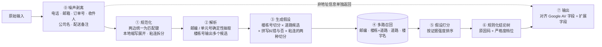
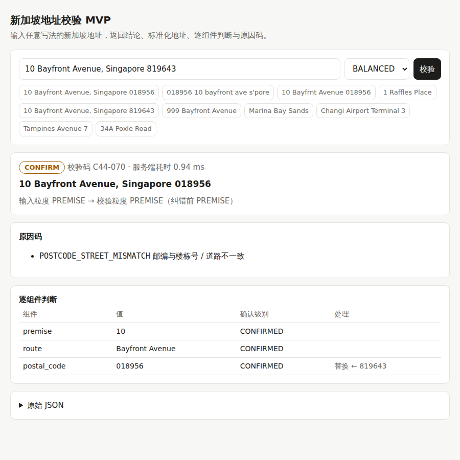
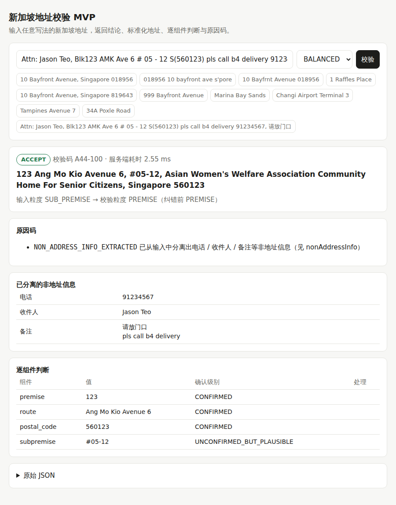

# 07 · MVP 技术方案与验证结论（新加坡）

> 目的：用一个**已经实现、可以本地运行**的 MVP，回答三个问题：
> 1. 地址校验在技术上**可行吗**？
> 2. 我们选的技术方案，比"更简单的做法"**好多少**？每个模块是不是都**必要**？
> 3. 从 MVP 到生产，**真正的风险在哪**？
>
> 代码与复现步骤见 [`mvp/`](../mvp/README.md)，完整评测报告见 [`mvp/reports/eval_report.md`](../mvp/reports/eval_report.md)。

---

## 1. 结论先行

| 问题 | 结论 | 证据 |
|---|---|---|
| 可行吗？ | **可行。** 在新加坡 13.3 万个真实地址构成的参考库上，4,000 条覆盖 10 类错误的测试样本中，完全正确率 **99.9%**，**误收率 0%**，单条延迟 P50 约 1ms、P95 约 13ms | 第 4 节 |
| 比简单做法好多少？ | 直接复用"整串模糊匹配"（相当于拿现有地理编码 / 搜索能力来做校验）只有 **53.9%**；"只查邮编"只有 **57.6%**，且两者都会把大量坏地址或错地址**静默放行**（13–14%） | 第 4.1 节 |
| 每个模块都必要吗？ | **是。** 去掉任何一个核心模块，完全正确率都会下降 **4.9–12.7 个百分点**，而且下降集中在它负责的那一类错误上 | 第 4.3 节 |
| 真实客户输入（混着电话、收件人、备注、本地缩写、粘连、错拼）能处理吗？ | **能。** 1,800 条带业务噪声的测试样本上，地址识别率 **98.8%**，**86.1%** 可以直接通过、无需打扰用户（上一版只有 13.8%），电话 / 收件人 / 备注被单独拆出来返回，静默错误 0% | 第 4.6 节 |
| 最大风险在哪？ | **不在算法，在数据时效。** 模拟"新楼盘还没进库"时，96% 的新地址会被误拒；换成"不完整数据"模式能把误拒降到 10%，但代价是完全识别不出不存在的楼栋号。**参考数据的完整度和更新速度，决定了产品上限** | 第 4.5 节 |

> **关于"最优解"的准确说法：** 在我们实际实现并对比的 6 种方案里，本方案在所有**质量指标**上最优或并列最优（延迟方面更简单的方案更快，但本方案 P95 约 13ms，已远低于 [02 文档](02-capability-architecture.md) 设定的 200ms 目标），并且消融实验证明它的每个组成部分都不可省略。这**不等于**证明了它是全局最优。未实现对比的方案（大模型解析、机器学习排序）我们在第 5 节给出了不作为首选的理由，这些理由同样需要在真实数据上再验证。

---

## 2. 技术方案（已实现）



### 2.1 关键设计决策（每一条都对应评测里的一类问题）

| # | 决策 | 为什么 | 对应的坑 |
|---|---|---|---|
| 1 | **输入和参考库两边都转成同一套"规范匹配键"**（AVENUE / AVE / AV 统一为 AVE） | 不用去猜 "ST" 是 Street 还是 Saint，两边一致即可 | `St George's Rd` = `Saint George's Road` |
| 2 | **解析只做确定性的事**（6 位邮编、`#楼层-单元`），楼栋号给出**多个候选** | "Tampines Avenue 7" 里的 7 是路名的一部分，"7 Tampines Avenue" 里的 7 是楼栋号，只有对照参考库才知道 | 路名里的数字被当成楼栋号 |
| 3 | **数字不做模糊匹配**，道路只在"数字部分完全相同"的道路之间模糊比较 | "Ang Mo Kio Ave 3" 和 "Ave 5" 字面只差一个字符，但是两条不同的路 | 把 Ave 3 "纠正" 成 Ave 5 |
| 4 | **多路召回**：邮编、楼栋+道路、道路、楼宇名各自召回，再合并 | 任何单一线索都可能是错的；要能发现线索之间的矛盾 | 邮编填错、只写楼宇名 |
| 5 | **按证据强度给假设排序**：邮编+楼栋+道路三者一致 > 任意两者一致 > 一个线索 | 两个独立字段互相印证，比任何单一字段都可靠 | 错误邮编恰好属于另一个同号楼栋 |
| 6 | **"被更长路名包含"的解释降级** | 避免把拼错的长路名截成一条较短的真路名，也避免把真实的长路名模糊成另一条路 | `1 Vdictoria Park Road` 不应变成 `1 Park Road`；`24 Keppel Bay View` 不应变成 `24 Keppel Bay Drive` |
| 7 | **替换要保守**：邮编与楼栋号指向同一条路上的不同楼栋时，直接判 FIX 并给出候选，不擅自替换 | 无法判断哪个输错了，替换错了比不替换更糟 | `7B North Canal Road 048821` |
| 8 | **结论用可读的规则树，而不是黑盒打分**；每个分支对应一个原因码 | 产品、客服、客户都能看懂"为什么"；每个错例都能定位到具体分支 | 可解释、可审计 |
| 9 | **严格度档位**（STRICT / BALANCED / LENIENT） | 不同客户对误收 / 误拒的容忍度不同（见 [02 文档](02-capability-architecture.md)） | 同一引擎服务结账和 KYC |
| 10 | **"参考库是否完整"作为显式开关** | 数据完整的区域"查不到"就是不存在；不完整的区域只能说"无法确认" | 见第 4.5 节 |
| 11 | **先剥业务噪声，但删之前先问参考库"这段像不像地址"** | 电话、订单号会干扰邮编识别（订单号里常有 6 位数字）；但 "Brilliant Student Care""Time Out Smarties Pte Ltd" 这类真实楼宇名看起来也像备注 / 公司名 | 剥过头时自动退回原文再试 |
| 12 | **剥出来的信息不丢弃，作为 `nonAddressInfo` 单独返回** | 物流客户正好需要把电话、收件人、备注拆成独立字段；同时地址本身可以直接通过，不必因为"有看不懂的字"而打扰用户 | 上一版在噪声输入上只有 13.8% 能直接通过 |
| 13 | **本地缩写（AMK / CCK / TPY…）作为规范化的一部分**；两字母缩写（JW / PR…）只在后面紧跟路型词时展开 | 本地用户最常见的写法；两字母缩写容易与其他词撞车 | `Blk 450 AMK Ave 10` |
| 14 | **粘连写法两种切分都试，逐词拼写纠错作为备选**，都交给打分裁决而不是直接替换 | "111CAMOY" 可能是 111 Camoy，也可能是 111C Amoy；纠错可能误伤 | `28eOxleY road` → 28E Oxley Road |

### 2.2 输出示例

`10 Bayfront Avenue, Singapore 819643`（邮编填成了樟宜机场 T2 的邮编）：

- 结论 `CONFIRM`，原因码 `POSTCODE_STREET_MISMATCH`
- 建议地址 `10 Bayfront Avenue, Singapore 018956`
- 楼栋号、道路均为 `CONFIRMED`，邮编标记为 `replaced`，并保留原值 819643
- 校验码 `C44-070`，改动幅度 70（替换了一个组件）



---

## 3. 验证方法

| 项目 | 做法 |
|---|---|
| 参考库 | OneMap 新加坡邮编全量导出（14.2 万条记录，按楼栋号 + 道路 + 邮编聚合为 13.3 万个地址实体、3,867 条道路） |
| 评测集 | 按 [04 文档](04-evaluation-framework.md) 的错误类别自动构造，10 类 × 400 条 = 4,000 条测试样本 |
| 标签 | **按类别语义事先定义**（如"邮编错误 → CONFIRM 并给出正确地址""楼栋号不存在 → FIX"），不是用本方案的输出反推 |
| 开发 / 测试隔离 | 开发集与测试集使用**不相交**的地址实体；开发集只用于调对照方案的阈值 |
| 对照方案的公平性 | B1 的阈值在开发集上网格搜索，取**对它最有利**的一组 |
| 防止"对着考卷改代码" | 迭代期间用的测试集（种子 A）已被看过、不再"干净"；**最终数字来自一个全新种子生成、从未参与迭代的测试集（种子 B）** |

**迭代记录（保持透明）：**

| 版本 | 改动来源 | 完全正确率 |
|---|---|---|
| v0 | 第一版实现 | 98.2%（种子 A 测试集） |
| v1 | 仅根据**开发集**错例修复：路名数字被当成楼栋号、路型词拼错、楼宇名含数字 / 国家名 | 99.6%（种子 A） |
| v2 | 查看了种子 A 测试集错例后修复："SIN" 被误当成国家名、被包含路名降级、模糊匹配保留前 3 个候选、邮编 + 楼栋号证据 | 100.0%（种子 A，已不可信） |
| **最终** | 不再修改决策逻辑 | **99.9%（种子 B，从未看过）** |

---

## 4. 结果（种子 B 测试集，4,000 条）

### 4.1 总览

| 方案 | 完全正确率 | 误收率 ↓ | 误拒率 ↓ | 地址正确率 ↑ | 静默错误率 ↓ | 单条延迟 |
|---|---|---|---|---|---|---|
| **本方案（BALANCED）** | **99.9%** | **0.0%** | **0.1%** | **100.0%** | **0.0%** | P50 1.2ms / P95 12.5ms |
| B1 模糊整串匹配（Geocoder 式） | 53.9% | 7.0% | 28.3% | 76.6% | 13.9% | 约 1.6ms（4 核批量） |
| B2 仅查邮编 | 57.6% | 0.0% | 35.7% | 71.7% | 12.8% | < 0.1ms |

- **静默错误率**是最危险的指标：系统说"没问题"（ACCEPT），但其实是坏地址或给错了地址。两个简单方案都有 13–14% 的静默错误，本方案为 0。
- B2 的误收率为 0，是因为测试集里的坏地址大多没填邮编，它一律拒绝；代价是 35.7% 的好地址被误拒。

### 4.2 分类别完全正确率

| 类别 | 期望结论 | 本方案 | B1 模糊整串 | B2 仅邮编 |
|---|---|---|---|---|
| A 标准正确 | ACCEPT | 100.0% | 83.0% | 92.8% |
| B 格式混乱（缩写 / 大小写 / 顺序 / 邮编写法） | ACCEPT | 100.0% | 86.8% | 90.5% |
| C 道路拼写错误 | CONFIRM | 99.5% | 0.0% | 0.0% |
| D1 缺邮编 | CONFIRM | 100.0% | 0.0% | 0.0% |
| D2 缺楼栋号 | FIX | 100.0% | 97.2% | 100.0% |
| E 邮编错误 | CONFIRM | 100.0% | 0.0% | 0.0% |
| F1 楼栋号不存在 | FIX | 100.0% | 82.0% | 100.0% |
| F2 道路不存在 | FIX | 100.0% | 99.8% | 100.0% |
| G 仅楼宇名 | CONFIRM | 99.8% | 0.0% | 0.0% |
| I 带单元号 | ACCEPT | 100.0% | 90.0% | 92.8% |

> 简单方案在 C / D1 / E / G 四类上全军覆没：它们**没有"纠正并请用户确认"的能力**，只能在"通过"和"拒绝"之间二选一。而这四类恰恰是地址校验相比地理编码的核心价值。

### 4.3 消融实验：每个模块都有用

| 去掉的模块 | 完全正确率 | 下降 | 主要受影响的类别 |
|---|---|---|---|
| （完整方案） | 99.9% | — | — |
| 邮编交叉校验 | 87.2% | −12.7 | E 邮编错误 100% → 0%：错误邮编被直接信任 |
| 楼宇名召回 | 90.2% | −9.7 | G 仅楼宇名 99.8% → 2.2%；误拒率升到 13.8% |
| 道路拼写纠错 | 95.0% | −4.9 | C 道路拼写错误 99.5% → 50.0%；误拒率升到 7.1% |

### 4.4 严格度档位

| 档位 | 直接通过率 | 误收率 | 误拒率 | 需用户确认的比例（在本应直接通过的样本中） |
|---|---|---|---|---|
| STRICT | 20.0% | 0% | 0.1% | 33.3%（带单元号的地址也要确认） |
| BALANCED（默认） | 30.0% | 0% | 0.1% | 0% |
| LENIENT | 50.0% | 0% | 0.1% | 0%（补全邮编、拼写纠正也直接通过） |

同一引擎，通过档位就能在"少打扰用户"和"多一次确认"之间切换，而误收率不变。

### 4.5 ⚠️ 数据时效实验：真正的风险

从参考库里拿掉 500 个真实地址，模拟"新楼盘还没进库"：

| 设置 | 新地址被误拒（FIX） | 新地址被判 CONFIRM | 不存在楼栋的检出率 |
|---|---|---|---|
| 认为参考库完整（默认） | **96.2%** | 3.8% | 100% |
| 认为参考库可能不完整 | 10.4% | 89.6% | **0%** |

**解读：** 算法无法区分"这个楼栋号不存在"和"这个楼栋号存在，但还没进库"。所以：

- 参考库**越完整、越及时**，就越能放心地说"不存在"。这是产品质量的上限。
- 本 MVP 用的是 **2017 年**的数据导出，直接上线会误拒近几年的新楼盘（如新 BTO 组屋）。**生产环境的第一优先级是拿到最新的授权数据，并建立持续更新机制。**
- 这印证了 [03 数据策略](03-data-strategy-sea.md) 里"区域完整度"的判断：应当按区域衡量数据完整度，在新开发片区自动切换到"不完整"模式。

### 4.6 真实客户输入：业务噪声、本地缩写、粘连、错拼

前面的测试集只覆盖"干净"的变形（缩写、大小写、顺序、一处拼写错误）。真实订单里的地址往往长这样：

```
Attn: Jason Teo, Blk123 AMK Ave 6 # 05 - 12 S(560123) pls call b4 delivery 91234567, 请放门口
kopi corner pte. ltd. ;62 hillside drive ;549011 tel: 64393769 (awb 505976210028)
```

为此另建了一套噪声评测集（`scripts/make_noisy_set.py`），按新加坡电商 / 物流订单的常见写法构造 9 类样本；开发集 540 条用于迭代，**最终数字来自从未参与迭代的 1,800 条测试集**。

| 方案 | 地址识别率 ↑ | 直接通过率 ↑ | 误拒率 ↓ | 静默错误率 ↓ | 无地址输入拒绝率 ↑ | 单元号保留率 | 电话抽取 |
|---|---|---|---|---|---|---|---|
| **本版** | **98.8%** | **86.1%** | **1.1%** | **0.0%** | **100%** | **100%** | **100%** |
| 上一版 MVP | 96.0% | 13.8% | 3.2% | 0.0% | 100% | 76.7% | 不支持 |
| B1 模糊整串匹配 | 58.7% | 58.7% | 30.3% | 10.3% | 95.0% | — | — |
| B2 仅查邮编 | 85.0% | 85.0% | 7.0% | 7.1% | 100% | — | — |

- **地址识别率**：输入里有真实地址时，找对了这个地址（ACCEPT 或 CONFIRM）的比例。
- **直接通过率**：找对了、并且不需要再打扰用户确认的比例。"两处拼写错误"一类按设计应请用户确认，所以理论上限为 87.5%（1,600 条中有 200 条属于这一类）。

| 类别 | 上一版 | 本版 | B1 | B2 |
|---|---|---|---|---|
| N1 电话 / 邮箱 / 订单号 | 100% | 100% | 35.5% | 89.5% |
| N2 收件人 / 公司名 | 100% | 100% | 57.5% | 91.0% |
| N3 配送备注（中英文） | 100% | 100% | 65.5% | 90.0% |
| N4 本地缩写（AMK / CCK…） | 95.0% | 100% | 79.0% | 95.5% |
| N5 粘连 / 标点 / 大小写 | 86.5% | 100% | 78.5% | 91.5% |
| N6 两处拼写错误 | 89.0% | 90.0% | 68.0% | 45.0% |
| N7 单元号多种写法 | 100% | 100% | 81.5% | 93.5% |
| N8 多种噪声叠加 | 97.5% | 100% | 4.0% | 84.0% |
| N9 根本没有地址（应拒绝） | 100% | 100% | 95.0% | 100% |

**解读：**

1. **"找对地址"上一版就已经不错（96.0%）**：邮编 + 楼栋号互相印证的设计本身就抗噪声。
2. **真正的差距在"能不能直接通过"**：上一版把电话、人名、备注都当成"看不懂的片段"，于是几乎每单都要用户确认（直接通过率 13.8%），这在结账场景等于没法用。本版把这些信息剥离出来单独返回后，直接通过率提到 86.1%。
3. **B2（只查邮编）在噪声输入上的识别率反而不低（85.0%）**，因为真实订单大多填了邮编；但它有 **7.1% 的静默错误**，也就是邮编填错时照单全收。
4. **剩下的错误集中在"没有邮编 + 短路名两处拼错"**（如 `24 Llqc Walk` → Lilac Walk）：两处拼错的短词超出了编辑距离上限，只能请用户修改。有邮编时这类都能靠邮编 + 楼栋号救回来。



---

## 5. 为什么不选其他技术路线

| 路线 | 本次是否实测 | 判断 | 理由 |
|---|---|---|---|
| 直接复用地理编码 / 搜索（整串模糊匹配） | ✅ 实测（B1） | ❌ 不可行 | 完全正确率 53.9%，静默错误 13.9%；只会"找最像的"，没有"发现矛盾、说不存在"的能力 |
| 只查邮编（新加坡邮编几乎一楼一码） | ✅ 实测（B2） | ❌ 不够 | 57.6%；邮编一错就全错，缺邮编一律拒绝 |
| 规则解析 + 多路召回 + 证据打分 + 规则结论（本方案） | ✅ 实测 | ✅ 选定 | 99.9%，1ms 级延迟，可解释，每个模块都经消融验证 |
| 大模型（LLM）直接做解析或判断 | ❌ 未实测 | 不作为热路径首选 | 延迟（百毫秒到秒级）和单次成本比本方案高 2–3 个数量级；输出不确定、难以审计；本次发现的难点主要**不在"读懂地址"，而在"与参考库比对后下结论"**，这部分必须依赖参考库。建议用于：离线生成训练数据、处理非正式地址的长尾兜底 |
| 通用开源解析器（如 libpostal） | ❌ 未实测 | 可作为多国扩展时的解析组件 | 它只解决"切分组件"，不解决"是否存在、是否矛盾"；新加坡的邮编 / 单元号格式规则化抽取已足够 |
| 机器学习排序模型（Learning to Rank） | ❌ 未实测 | 第二阶段引入 | 需要大量真实标注数据；本方案的规则打分可以先作为基线和标注数据的生成器，等真实流量数据积累后再训练模型校准置信度 |

---

## 6. 已知局限（必须诚实看待）

1. **封闭世界测试。** 测试集由参考库构造，所有真实地址都在库里，所以 99.9% 证明的是**逻辑可行**，不代表真实流量上的准确率。真实准确率会更低，主要受数据时效影响（第 4.5 节）。
2. **数据陈旧且未授权商用。** OneMap 2017 年导出，仅用于验证；生产需要 SLA / OneMap 的最新数据与授权。
3. **单元级没有验证。** 没有单元级数据，所以 `#楼层-单元` 只能做格式校验，判为"合理但未确认"。已实现楼栋属性接口（如 HDB 楼栋最高楼层），接入 data.gov.sg 的 HDB 楼栋数据即可识别"楼层超过楼高"和"组屋缺单元号"，这部分有单元测试覆盖，但未在真实数据上评测。
4. **"楼宇名"多为楼内商户和 POI。** OneMap 的楼宇名字段里有大量银行网点、店铺名，只输入楼宇名时的体验取决于 POI 数据的质量。
5. **剩余错例**（为保持最终数字无偏，看到测试集错例后未针对性修复）：
   - 原测试集 3 条："Estate" 这类路型词拼错；楼宇名里含 "S'pore"；新增的逐词纠错把 `Parubry Avenue` 纠成了 Parry Avenue（结论是请用户确认，不是静默放行）
   - 噪声测试集：`33 Jalan Rdam, Singapore 576969` 被建议成 Jalan Adat。原因是"楼栋号 + 纠错得来的路名"压过了"楼栋号 + 邮编"两个原样一致的字段；修法明确（纠错得来的证据应弱于原样一致的证据），待下一轮在新测试集上验证
   - 楼栋号带连字符（`188-2B`）在本版已支持
6. **只覆盖新加坡。** 马来西亚、印尼等需要各自的国家规则包，而且"非正式地址"的逻辑需要重新设计（见 [03 文档](03-data-strategy-sea.md)）。
7. **没有和 Google / Loqate 在同一测试集上对比。** 这是下一步最重要的验证（见 [04 文档](04-evaluation-framework.md) 第 5 节，需法务确认）。
8. **噪声样式是按经验构造的。** 电话 / 收件人 / 备注的写法、本地缩写表都来自对新加坡订单的常识，真实分布需要用客户数据校准；缩写表之外的写法（如新的昵称式缩写）识别不了。
9. **没有标记的首段人名靠启发式识别。** 放在最前面、全是字母、在参考库里查不到的一段会被当成收件人；如果那其实是一个参考库里没有的公寓名，会被归到"收件人"里（地址本身仍按楼栋号 + 道路 + 邮编校验）。

---

## 7. 从 MVP 到生产：建议的下一步

| 优先级 | 事项 | 目的 |
|---|---|---|
| P0 | 从 1–2 家客户拿 **500–1,000 条真实地址（原样，带噪声）**，人工标注后评测 | 得到真实流量下的准确率，校准噪声样式和缩写表，替代封闭世界的数字 |
| P0 | 获取**最新 OneMap / SLA 授权数据**，建立月度更新 | 解决第 4.5 节的数据时效风险 |
| P0 | 在同一真实样本上**对比 Google AV 与 Loqate** | 形成对外可讲的差异化证据 |
| P1 | 接入 **HDB 楼栋数据**（最高楼层、户数） | 打通单元级校验，这是相对 Google 的主要差异点 |
| P1 | 接入**配送签收 / 搜索选点等行为数据** | 发现新地址、提供入口点 |
| P2 | 服务化：容器化部署、批量接口、监控 | 对齐 [02 文档](02-capability-architecture.md) 的非功能要求 |
| P2 | 马来西亚国家规则包 | 验证框架的多国可扩展性 |
