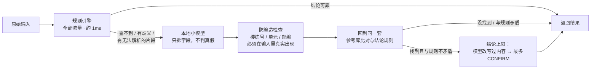

# 08 · 用 AI / 本地小模型增强地址校验

> 问题：能不能用 AI，特别是**在本地部署一个小模型（如 Qwen）**，把地址校验做得更好？
> 结论：**可以用，但定位是"兜底解析器"，不是替代品。** AI 负责读懂乱写的输入，参考库负责判断地址真假。接入代码已经写好、测好（[`mvp/avmvp/llm_fallback.py`](../mvp/avmvp/llm_fallback.py)），模型一就位就能出评测数字。

---

## 1. 结论先行

| 问题 | 结论 |
|---|---|
| AI 能不能直接判断地址对不对？ | **不能。** "这栋楼是否存在"是事实问题，小模型尤其容易编出看似合理的楼栋号和邮编。真假必须由参考库判断 |
| AI 适合做什么？ | **读懂输入**：从乱写的文字里拆出楼栋号、路名、单元、邮编、收件人、电话、备注，尤其是规则没见过的写法 |
| 在现有测试集上能提升多少？ | **很少。** 规则方案已经很高，就算小模型兜底全部做对，噪声集识别率也只能从 98.8% 提到 99.8%，标准集没有提升空间（见第 3 节） |
| 那它的价值在哪？ | 在**真实订单里规则覆盖不到的长尾写法**，以及**扩展到印尼 / 泰国 / 越南 / 菲律宾**时替代大量手写规则。这些合成测试集测不出来，必须用真实数据验证 |
| 为什么选本地部署？ | 地址 + 姓名 + 电话属于个人数据（新加坡 PDPA）。本地部署数据不出公司，没有按次调用费；代价是要自己准备算力 |

---

## 2. "本地小模型"有三条路线

| 路线 | 例子 | 优点 | 缺点 | 适合放在哪 |
|---|---|---|---|---|
| **A. 本地小型大语言模型** | Qwen 0.5B / 1.5B / 3B / 7B，用 Ollama、llama.cpp、vLLM 部署 | 能理解没见过的写法、多语言混写、地标描述；不用标注数据就能用；数据不出本地 | 单次调用慢（CPU 上可能是秒级，需实测）；越小的模型越容易乱编、越不听指令；需要 GPU 才能扛高并发 | **兜底**：只处理规则搞不定的约 10–14% 输入；**离线**：生成测试数据、辅助标注 |
| **B. 专用小模型（序列标注）** | CRF、小型 BERT 做地址字段标注；libpostal 也属于这一类 | 毫秒级、CPU 即可、结果稳定、可审计 | 需要标注数据训练；对完全没见过的说法泛化不如大语言模型 | **热路径**：替代或补充规则解析器 |
| **C. 云端大模型 API** | Claude 等 | 能力最强、不用运维 | 数据出境与合规评估；按次付费；有网络延迟 | 离线批处理、复杂长尾（合规允许时） |

**推荐组合：** 规则引擎处理全部流量，A 作为兜底和离线工具。等真实数据积累起来，再用 A 标注的数据训练 B，把能力"蒸馏"进毫秒级的热路径。

---

## 3. 先算清楚：在现有测试集上能提升多少

触发条件：规则结论为"查不到 / 有歧义 / 邮编与道路冲突"，或者结论里有无法解析的片段。

| 测试集 | 会触发兜底 | 当前识别率 | 兜底全部做对时的上限 | 触发的主要是哪类 |
|---|---|---|---|---|
| 噪声集（1,800 条） | 250 条（13.9%） | 98.8% | **99.8%** | 200 条是"根本没有地址"（本就该拒绝），28 条是两处拼错 |
| 标准集（4,000 条） | 401 条（10.0%） | 99.9% | **99.9%** | 400 条是"道路不存在"（本就该拒绝） |

**解读：**

- 合成测试集上，规则方案已经把能做的做完了，小模型最多再多救回 1 个百分点，而且都集中在"没填邮编 + 短路名拼错两处"这一类。
- 触发兜底的大部分输入**本来就应该拒绝**（根本没有地址、道路不存在）。对这些输入，模型的正确表现是"什么也不补"。这正是防编造规则要保证的，也是小模型最容易出错的地方。
- 所以**决定用不用，要看真实订单**：规则没见过的写法有多少、模型能救回多少、会不会引入编造。

---

## 4. 已实现的接入方式



**五条安全规则**（均有单元测试覆盖，见 [`tests/test_llm_fallback.py`](../mvp/tests/test_llm_fallback.py)）：

1. **只在规则搞不定时调用**：规则有把握的输入不经过模型，不增加延迟，也不引入风险。
2. **模型不判真假**：模型只输出结构化字段，由参考库决定地址是否存在。
3. **防编造**：模型给出的楼栋号、单元号、邮编，必须和输入里某一段完整数字一致，否则丢弃。比较的是整段数字而不是子串，避免编出的 "12" 恰好是电话 91234567 的一部分而蒙混过关。
4. **结论有上限**：模型改写过地址内容（如纠正了路名）时，最多给 CONFIRM，由用户确认；只有字段全部原样来自输入时才允许直接通过。
5. **不替用户做选择**：模型和规则给出不同地址时，保留规则结论，把模型的建议放进候选；模型服务超时或出错时，直接退回规则结果。

---

## 5. 在你本机运行（以 Ollama + Qwen 为例）

```bash
# 1. 安装 Ollama（https://ollama.com），拉取模型
ollama pull qwen2.5:1.5b            # 也可以试 qwen2.5:0.5b / 3b / 7b，越大越准、越慢

# 2. 评测：同一份测试集对比"规则 / 规则 + 模型兜底 / 纯模型"
cd mvp
python scripts/evaluate_llm.py --model qwen2.5:1.5b --limit 300          # 先抽样跑一小批
python scripts/evaluate_llm.py --model qwen2.5:1.5b --pure               # 噪声集全量，含纯模型对照
python scripts/evaluate_llm.py --set golden_test --model qwen2.5:1.5b    # 标准集

# 3. 演示页面开启兜底
python -m avmvp.server --llm-endpoint http://127.0.0.1:11434 --llm-model qwen2.5:1.5b
```

- **其他部署方式**：用 llama.cpp server、vLLM、LM Studio 等提供 OpenAI 兼容接口的服务，加 `--api openai --endpoint http://127.0.0.1:8080` 即可。
- **输出位置**：结果写到 `mvp/reports/llm_eval_<测试集>.md`，包括各方案的识别率、直接通过率、静默错误率、兜底调用比例和模型单次延迟。
- **纯模型对照的作用**：让模型直接判断"地址是否完整"、不查参考库，专门用来量化小模型会编造多少地址。

---

## 6. 用什么标准决定上不上

用**真实订单样本**（建议 500–1,000 条，原样不清洗）跑第 5 节的评测，满足以下条件再上线兜底：

| 指标 | 上线门槛（建议） |
|---|---|
| 地址识别率 | 相比只用规则有**明确提升**（例如 ≥ 1 个百分点） |
| 静默错误率 | **不上升**（这是红线） |
| 兜底调用比例 | 与算力预算匹配（例如 ≤ 15%） |
| 模型单次延迟 P95 | 满足业务场景：结账实时校验需要设超时并退回规则结果；批量清洗对延迟不敏感 |

同时比较不同大小的模型（0.5B / 1.5B / 3B / 7B），选**满足门槛的最小模型**，算力成本最低。

---

## 7. 当前状态与限制

- **已完成**：接入代码（支持 Ollama 与 OpenAI 兼容接口，仅用标准库）、五条安全规则、10 个单元测试（含本地假服务验证两种接口格式）、评测脚本、演示服务器开关。用假模型跑通了整条评测流程。
- **还没有真实模型的数字**：本次云端环境的网络策略拦截了模型权重的下载（Hugging Face / ModelScope / Ollama 均无法访问）。可以在你本机按第 5 节运行，或放开环境网络后由我在这里跑。
- **CPU 能否扛住**：本环境只有 4 核 CPU、没有 GPU。小模型在 CPU 上单次调用可能要数秒，只适合兜底和离线场景；生产环境的高并发兜底需要 GPU，具体规格以实测延迟和兜底比例来估算。
