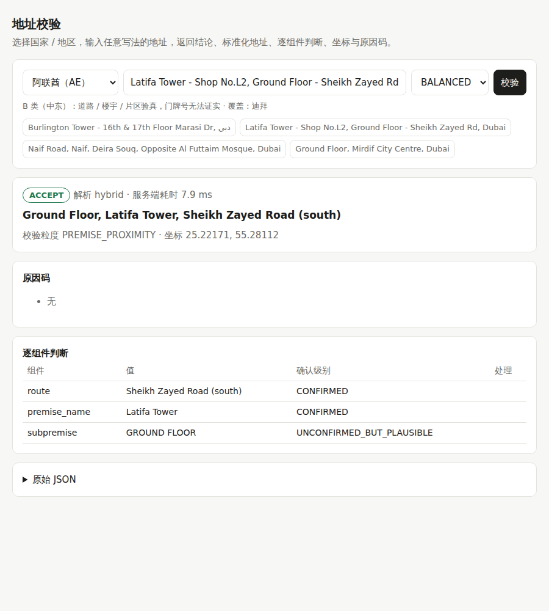

# 13 · 多市场地址校验：成品说明（新加坡 + 澳洲 + 欧洲 + 中东 + 东南亚）

> 目标：一套服务覆盖 12 个市场，接口对齐 Google Address Validation；每个市场用同一套方法评测"规则 / AI / 规则 + AI"，用数据回答"规则和 AI 各用在哪"。
> 代码：[`avmvp/intl/`](../mvp/avmvp/intl)（多市场引擎）、[`avmvp/router.py`](../mvp/avmvp/router.py)（按国家分发）、[`avmvp/server.py`](../mvp/avmvp/server.py)（HTTP 服务 + 演示页面）
> 报告：[多市场评测（测试集）](../mvp/reports/markets_eval.md)、[开发集](../mvp/reports/markets_eval_dev.md)、[AI 解析器训练](../mvp/reports/crf_training.md)

---

## 1. 结论

| 问题 | 回答 |
|---|---|
| 做成了什么？ | 一个服务、一个接口（对齐 Google AV），按 `regionCode` 覆盖 **12 个市场**：新加坡（专用引擎）+ 澳洲、德国、法国、荷兰、阿联酋、沙特、马来西亚、印尼、泰国、越南、菲律宾（多市场引擎，各 1–2 个试点城市）。演示页面可切换国家；100 个单元测试 |
| 效果怎么样？ | 在**真实商户自填地址**上（每市场 1,000 条测试样本，商户本身不在参考库里）：**有官方地址表的 A 类市场找对 78–95%，直接通过 75–94%**；中东 32–35%、东南亚 59–74%。**偏差超过 1 公里的静默错误全部在 0.5–1.7% 之间**，接近商户坐标本身约 1% 的误差下限 |
| 规则好还是 AI 好？ | **混合最好**：两种解析都出候选、由参考数据裁决，在 11 个市场的真实地址上都是最好或并列最好。纯机器学习在合成地址上最好、在真实地址上最差（只见过模板写法）。A 类市场规则已接近上限；中东、东南亚混合比纯规则多 0.5–9 个百分点（菲律宾最多） |
| 瓶颈在哪？ | **中东和东南亚的瓶颈是参考数据，不是解析**：合成地址上能到 76–97%，真实地址差距来自"只写楼名 / 商户名"（迪拜 32%）和"同名道路"。没有开放门牌数据，最多只能验到楼宇 / 道路。**接入你们自有的楼栋 / 门牌 / POI 数据，同一个引擎就能走 A 类的逐门牌验真路径** |
| 怎么保证不乱放行？ | 每条"直接通过"的规则都在开发集上按证据组合校准过（第 7 节）：B / C 类道路级只有在"邮编与道路相互印证 + 道路名唯一"时才直接通过，其余要求确认并给出候选 |
| 新加坡 | 按真实写法调研结果升级后，在留出测试集上：真实商户地址（同一份 2026 参考库）直接通过 **76.9% → 85.9%**，误拒 1.3% → 0.7%，静默错误 0；模拟订单结论合理率 85.6% → 96.1%，缺单元号检出 22.5% → 74.0% |

---

## 2. 各市场结果（测试集，混合解析）

**真实商户地址**（每市场 1,000 条；"定位对" = 正确·直接通过 + 正确·要求确认）：

| 市场 | 类别 | 定位对 | 其中直接通过 | 判 FIX | 错误建议（要求确认） | 静默错误 | 其中偏差 >1 公里 | 毫秒/条 |
|---|---|---|---|---|---|---|---|---|
| 澳大利亚（AU） | A | **78.2%** | 75.4% | 13.1% | 4.8% | 3.9% | 1.7% | 3 |
| 德国（DE） | A | **95.4%** | 94.2% | 2.1% | 1.6% | 0.9% | 0.5% | 2 |
| 法国（FR） | A | **92.1%** | 88.9% | 5.9% | 0.8% | 1.2% | 0.7% | 2 |
| 荷兰（NL） | A | **88.8%** | 83.2% | 8.9% | 0.7% | 1.6% | 0.8% | 3 |
| 阿联酋（AE） | B | **31.9%** | 1.6% | 31.9% | 35.2% | 1.0% | 0.7% | 5 |
| 沙特（SA） | B | **34.6%** | 2.6% | 22.0% | 42.7% | 0.7% | 0.6% | 6 |
| 马来西亚（MY） | C | **74.1%** | 34.4% | 7.7% | 15.6% | 2.6% | 1.2% | 5 |
| 印尼（ID） | C | **59.7%** | 28.4% | 5.8% | 30.4% | 4.1% | 1.5% | 6 |
| 泰国（TH） | C | **59.4%** | 17.7% | 16.8% | 21.1% | 2.7% | 1.1% | 8 |
| 越南（VN） | C | **64.7%** | 13.6% | 4.9% | 28.5% | 1.9% | 0.8% | 5 |
| 菲律宾（PH） | C | **63.5%** | 21.4% | 15.0% | 19.1% | 2.4% | 1.0% | 5 |

- A 类的"判 FIX"主要是门牌不在官方表里（澳洲 13%：商场铺位、只写路名、`Australia Square, 264 George St` 这类楼名 + 门牌），这是 A 类该有的行为。
- B / C 类"错误建议"比例高，是因为同名道路多、只能验到道路：这些都**要求用户确认并给出候选**（用户有机会发现），不计入静默错误。
- 完整报告：[reports/markets_eval.md](../mvp/reports/markets_eval.md)（含规则 / 机器学习 / 混合三种解析的全部分类和错误样例）；开发集：[reports/markets_eval_dev.md](../mvp/reports/markets_eval_dev.md)。

**关于测试集跑了两次**：第一次运行（[reports/markets_eval_run1.md](../mvp/reports/markets_eval_run1.md)）后，分析荷兰 22.6% 的 FIX，发现是门牌写法问题（荷兰 `35hs`、`283-30` = 门牌 + 附加号码；澳洲 `51-55` = 门牌区间），这些写法在开发集里同样常见（澳洲开发集 13% 的地址带区间门牌），属于通用修复。修复后重跑，上表为第二次结果。两次对比：荷兰 75.5% → 88.8%、德国 93.0% → 95.4%、澳洲 76.7% → 78.2%、法国 91.0% → 92.1%，其他市场变化在 ±0.1 个百分点内。之后没有再根据测试集做任何修改。




---

## 3. 产品形态

### 3.1 接口

```bash
python -m avmvp.server            # http://127.0.0.1:8080/  演示页面（可选国家）
```

| 接口 | 说明 |
|---|---|
| `POST /v1/address:validate` | 请求体与 Google AV 相同：`{"address": {"regionCode": "AE", "addressLines": ["…"], "locality": "…", "postalCode": "…"}, "strictness": "BALANCED"}`；`regionCode` 决定用哪个市场的引擎，缺省为 SG |
| `GET /v1/markets` | 开放的市场、类别（A / B / C）、覆盖城市、参考数据是否已构建 / 已加载 |
| `GET /healthz` | 健康检查 |

响应字段与新加坡引擎一致（`verdict.possibleNextAction / validationGranularity / reasons`、`address.formattedAddress / addressComponents / missingComponentTypes`、`geocode.location / plusCode`、`nonAddressInfo`、`candidates`），多市场引擎另有：
- `result.codes`：从输入里识别出的地址编码（Plus Code、迪拜 Makani 10 位号码、沙特国家地址短码）
- `result.metadata`：`regionCode`、`marketClass`（A / B / C）、`parser`（rules / crf / hybrid）

### 3.2 结论怎么定

| | A 类（新加坡、澳洲、德国、法国、荷兰） | B 类（阿联酋、沙特）/ C 类（马来西亚、印尼、泰国、越南、菲律宾） |
|---|---|---|
| 验真依据 | 官方地址表：这条路上有没有这个门牌 | 地图数据：道路是否存在、是否在所写片区内、邮编 / 楼宇 / POI 是否在道路附近 |
| 最高粒度 | `PREMISE`（门牌），多单元楼缺单元号时 `CONFIRM_ADD_SUBPREMISES` | `PREMISE_PROXIMITY`（楼宇 / POI 或 Plus Code 定位）、`ROUTE`（道路） |
| ACCEPT | 门牌在官方表里，且没有纠错 / 替换 | 楼宇在所写道路旁；或 Plus Code / 坐标与所写道路、片区一致；或道路级：写了门牌、道路名在城市里唯一、邮编与道路相互印证（第 7 节） |
| CONFIRM | 道路名纠错、邮编被替换、只凭楼宇定位 | 道路级缺少邮编印证或同名道路不止一条、只匹配上部分道路名、拼写纠错、缺门牌 / 楼名 |
| FIX | 门牌不存在 / 没写门牌 | 只能确认到片区，或什么都找不到 |

B / C 类的门牌号只能标为"合理但未证实"（`UNCONFIRMED_BUT_PLAUSIBLE`）：没有开放的门牌数据，这和 Google AV 在这些国家的做法一致（Google 在印尼、泰国、越南、菲律宾不提供 AV）。接入自有楼栋 / 门牌数据后，同一套引擎就能验到门牌（见第 9 节）。

### 3.3 处理流程

```
输入 ─► 噪声剥离（电话 / 邮箱 / 网址）+ 编码识别（Plus Code / Makani / 沙特短码）
     ─► 解析（按市场选）：规则 + 地名表 │ 机器学习（CRF）│ 两者都出候选
     ─► 召回：道路（完整名 / 去类型词 / 容错 / 阿拉伯文转写 / 泰文无空格）、片区、楼宇 / POI、邮编
     ─► 证据打分：片区包含、邮编距离、楼宇距离、官方地址点、同名道路消歧
     ─► 结论 + 粒度 + 坐标 + 逐组件确认级别 + 原因码
```

各市场的写法差异放在配置里（[`markets.py`](../mvp/avmvp/intl/markets.py)、[`text.py`](../mvp/avmvp/intl/text.py)）：门牌在道路前还是后、邮编格式、缩写（`Jl.` / `Jln` / `Str.` / `Đ.` / `ถ.`）、类型词（Jalan / Đường / Rue / شارع，允许省略）、人名缩写（`M.H. Thamrin` = `MH Thamrin`）、国家 / 州名（不参与匹配）。

---

## 4. 参考数据

| 类别 | 市场（试点城市） | 道路 | 片区 | 楼宇 / POI | 门牌 |
|---|---|---|---|---|---|
| A | 澳洲（悉尼、墨尔本）、德国（柏林）、法国（巴黎）、荷兰（阿姆斯特丹） | Overture 路网（OSM），沿线形约 80 米取一点 | Overture 行政区 / 社区边界 | Overture POI | **官方地址表**：澳洲 G-NAF 365 万、荷兰 BAG 69 万、德国柏林 / 勃兰登堡 56 万、法国 BAN 27 万 |
| B | 阿联酋（迪拜）、沙特（利雅得） | 同上，阿拉伯文 + 英文名称 | 同上 | 同上 | 无（接入 Makani / 沙特国家地址后可有） |
| C | 马来西亚（吉隆坡）、印尼（雅加达）、泰国（曼谷）、越南（胡志明市）、菲律宾（马尼拉） | 同上 | 同上 | 同上 | 无（需自有数据） |

- 同名路段合并：沿线点落在同一个约 150 米格子里（首尾相接、双向车道）或路段中心 400 米内，视为同一条路。长路（如利雅得的 King Khurais Road）不再被拆成几十段。
- 邮编：A 类取官方地址表；B / C 类取 POI 邮编的中位位置，只能定位到片区。
- **POI 按编号哈希留出 20% 作测试，不进参考库**：评测时商户自己不在库里，避免"用答案找答案"。
- 许可：道路 / 片区 ODbL；POI CDLA-Permissive-2.0 等；官方地址点见 [mvp/README](../mvp/README.md#数据来源与许可)。**澳洲 G-NAF 在 Overture 里标注为专有许可（G-NAF 最终用户许可，限制用于生成邮寄地址），商用前需法务确认。**

---

## 5. 评测方法

| 测试集 | 做法 | 标准答案 | 判对标准 |
|---|---|---|---|
| **真实商户地址**（每市场 1,000 条） | 留出的 20% 商户在 Meta / Foursquare / 微软等平台自填的地址 + 城市 + 邮编，和结账表单一样 | 商户坐标（弱标注） | 门牌级 ≤ 250 米、楼宇级 ≤ 400 米、道路级为该道路经过商户 250 米内、片区级 ≤ 3 公里 |
| **合成地址**（每市场 1,000 条） | 按各市场写法渲染"测试部分"的道路（按道路名哈希分，AI 解析器训练时没见过这些道路名），30% 加拼写 / 大小写噪声 | 渲染时用的道路 / 地址点 | 找对道路（A 类找对地址点） |

- **开发集和测试集分开**：开发集（每市场 600 条真实 + 600 条合成，与测试集不重叠）用于迭代，测试集只在最后运行。
- **弱标注的误差**：商户坐标本身不总是准的。A 类市场里，官方地址点确认过的门牌与商户坐标相距超过 1 公里的比例约 1%，这是标注噪声的下限。所以另外统计**"偏差 >1 公里"的静默错误**：这部分不是坐标不准能解释的，是真正的错。
- **结果分类**：正确·直接通过 / 正确·要求确认 / 判 FIX / 错误建议（给错但要求确认，用户有机会发现） / **静默错误**（给错且直接通过，最危险）。

---

## 6. 规则和 AI：数据给出的回答

三种解析方式都用同一个参考库和同一套证据打分，只有"理解输入"这一步不同：
- **规则**：地名表最长匹配 + 各市场写法规则。
- **机器学习（CRF）**：给每个词打标签（门牌 / 单元 / 道路 / 楼宇 / 片区 / 城市 / 邮编）。用参考库按各国写法渲染的 2 万条样本训练，不需要人工标注（libpostal 同一路线）。
- **混合**：两者都生成候选，由参考数据裁决。

| 市场 | 真实：规则 | 真实：机器学习 | 真实：混合 | 合成：规则 | 合成：机器学习 | 合成：混合 |
|---|---|---|---|---|---|---|
| 澳大利亚（AU） | **78.2%** | 71.4% | **78.2%** | 91.2% | **92.4%** | 92.3% |
| 德国（DE） | 93.7% | 87.8% | **95.4%** | 86.4% | **92.7%** | 90.6% |
| 法国（FR） | 91.4% | 90.2% | **92.1%** | 92.6% | **94.8%** | 94.8% |
| 荷兰（NL） | 88.7% | 74.1% | **88.8%** | 93.7% | **95.3%** | 94.5% |
| 阿联酋（AE） | 31.4% | 20.0% | **31.9%** | 47.2% | 76.0% | **76.2%** |
| 沙特（SA） | 30.2% | 28.5% | **34.6%** | 77.0% | **92.9%** | 92.8% |
| 马来西亚（MY） | 71.4% | 68.4% | **74.1%** | 90.3% | **96.1%** | 95.8% |
| 印尼（ID） | 56.7% | 44.2% | **59.7%** | 89.1% | **93.5%** | 93.3% |
| 泰国（TH） | 58.6% | 41.7% | **59.4%** | 94.3% | **96.9%** | 96.9% |
| 越南（VN） | 62.6% | 47.2% | **64.7%** | 89.0% | **96.0%** | 94.8% |
| 菲律宾（PH） | 54.1% | 53.7% | **63.5%** | 87.0% | 89.3% | **91.1%** |

**结论**：
1. **在真实地址上，混合方案在每个市场都是最好或并列最好。** 纯机器学习在合成地址上最好，在真实地址上反而最差：它只见过按模板渲染的地址，真实写法（楼名在前、夹杂商户名、邮编写两遍、Plus Code、P.O. Box）比模板多样得多。**机器学习的价值是补规则的漏，不是替代规则。**
2. **A 类市场规则已经接近上限**，混合只多 0–2 个百分点；剩下的错误主要是弱标注误差和参考数据的问题，不是解析问题。与新加坡的结论一致。
3. **B / C 类市场的瓶颈不在"理解输入"，而在参考数据。** 合成地址上混合方案能到 76–97%，真实地址只有 32–74%。失败原因（混合方案，测试集）：

| 市场 | 没有可核对的道路 / 楼宇（只有楼名、商户名、片区） | 道路找到了，但不经过商户位置 | 只凭楼宇 / POI，位置不对 |
|---|---|---|---|
| 阿联酋（AE） | 31.9% | 27.5% | 7.2% |
| 沙特（SA） | 22.0% | 39.0% | 3.3% |
| 马来西亚（MY） | 7.7% | 17.2% | 0.7% |
| 印尼（ID） | 5.9% | 33.1% | 1.0% |
| 泰国（TH） | 16.8% | 21.0% | 2.8% |
| 越南（VN） | 4.9% | 29.3% | 1.1% |
| 菲律宾（PH） | 15.0% | 17.4% | 3.2% |

   - **没有可核对的道路 / 楼宇**：只写了楼名、商户名或片区（迪拜 32%、利雅得 22%）。POI 覆盖不全、楼名写法不一，需要自有楼栋数据。
   - **道路找到了，但不经过商户位置**：同名道路（利雅得、迪拜大量编号道路，雅加达 `Jalan Swadaya I` 有 23 条）、长路、商户坐标不准。这些**绝大部分被判为"要求确认"并给出候选**；直接通过且偏差超过 1 公里的只占全部样本的 0.6–1.5%（第 2 节表格最后两列）。
4. **本地小模型（LLM）还没有测到**：本环境的网络策略拦截了模型下载（Hugging Face / Ollama）。它最有希望的地方正是 B / C 类的"楼名、地标描述、多语种混写"。接入方式：作为第四种解析器，输出候选后同样由参考数据裁决（[08 文档](08-ai-local-model.md)的防编造规则不变）。开放网络后可用 `evaluate_markets.py` 直接对比。

---

## 7. 结论规则是怎么定的（开发集校准）

B / C 类没有门牌数据，**"道路级直接通过"是最容易出静默错误的地方**。在开发集上按证据组合统计了道路级 ACCEPT 的准确率（7 个市场，1,320 条）：

| 证据组合 | 条数 | 道路经过商户 250 米内 | 偏差 >1 公里 |
|---|---|---|---|
| 邮编 + 片区印证，名称完全一致，道路名唯一 | 378 | 88.6% | 3.4% |
| 邮编印证，名称完全一致，道路名唯一 | 231 | 88.7% | 3.9% |
| 邮编 + 片区印证，名称去类型词一致，道路名唯一 | 55 | 83.6% | 0.0% |
| 邮编 + 片区印证，但同名道路不止一条 | 149 | 84.6% | 7.4% |
| 只有片区印证，道路名唯一 | 102 | 85.3% | 9.8% |
| 没有任何印证，道路名唯一 | 152 | 78.9% | 15.8% |
| 只有片区印证，同名道路不止一条 | 37 | 59.5% | 37.8% |

于是规定：**道路级直接通过需要"邮编与道路相互印证 + 道路名在试点城市唯一 +（名称完全一致或片区也印证）"**，否则要求确认（原因码 `ROUTE_NOT_CORROBORATED`）。调整后 B / C 类"偏差 >1 公里的静默错误"从 2.5–4% 降到 0.2–1.5%，接近约 1% 的标注噪声下限；代价是直接通过率下降。阿联酋没有邮编，道路级一律要求确认，直接通过只来自楼宇（楼名在所写道路旁）和 Plus Code。

同样的思路也适用于上线后：用真实订单的签收结果按证据组合重新统计，按客户能接受的错误率设门槛（新加坡的做法见 [09](09-bayesian-scoring.md)、[10](10-labeled-data.md)）。

---

## 8. 迭代中修掉的问题（都来自开发集的错误样例）

| 市场 | 问题 | 处理 |
|---|---|---|
| 印尼、菲律宾 | `M.H. Thamrin`、`H. R. Rasuna Said` 的人名缩写拆成单字母，匹配到叫 `Jalan M` 的路 | 连续单字母合并（`MH THAMRIN`）；头衔 / 方位缩写统一（`Letjen` → Letnan Jenderal、`Tim.` → Timur） |
| 印尼 | `No.77` 的 `No` 展开成 NOMOR，匹配到叫 `Jalan N:O` 的路 | 门牌标记词不参与道路匹配 |
| 全部 B / C | "Riyadh"、"Dubai"、"กรุงเทพมหานคร" 当片区证据，给同名道路错误的"印证" | 全城名单独出现时不作片区证据；`Dubai Marina`、`Riyadh Park` 这类更长的名称照常匹配 |
| 澳洲 | `49 Edgar St, Glen Iris` 里 `STREET GLEN IRIS` 被当成 Glen Iris Road | 英文写法类型词在名称后面，片段开头的类型词不能用来匹配下一条路；名称不跨逗号 |
| 马来西亚 | 邮编写两遍被当成门牌；`2nd Floor, 109 …` 解析成单元 FLOOR 109；`Selangor` 匹配到 Jalan Selangor | 同一邮编全部去掉；序数楼层；州名 / 国家名不参与匹配 |
| 菲律宾、马来西亚 | `2F`、`GF` 楼层当门牌；`Sto. Tomas` 的 Sto 没展开 | 楼层写法识别；`Sto / Sta / Gen / Brgy / Ext` 展开 |
| 阿联酋 | 邮编栏填的是邮政信箱号（`5280 DUBAI`），被当门牌 | 除首段外只有数字的一段视为信箱号，单独抽出；`Villa 12` 视为门牌 |
| 沙特、阿联酋 | 英文写法（`Ibn Taymiyyah St.`）找不到只有阿拉伯文名称的道路 | **转写骨架**：两边都只比较辅音（ث/ت → T、ق/ك → K …），`Ibn Taymiyyah` 与 `ابن تيمية` 都是 `BNTM` |
| 沙特、阿联酋 | Plus Code（`PRX9+WV5`）只识别不定位；`00000` 占位邮编被当成矛盾 | **Plus Code 解码**（按公开规范实现，含短码按城市补齐），与所写道路 / 片区核对；占位邮编忽略 |
| 越南 | 5 位新邮编（71106）没识别，被当门牌 | 邮编 5 位 / 6 位都认 |
| 全部 | 长路只有路段中点，定位和距离都偏 | 路段带线形下载，沿线约 80 米取点；同名路段按线形合并 |
| 荷兰、澳洲 | `35hs`、`162A`、`283-30`（荷兰：门牌 + 附加）、`51-55 Memorial Ave`（澳洲：门牌区间）查不到 | 荷兰附加号码记为单元；区间按首尾门牌查。**这一条是在测试集错误分析里发现的**（开发集里同样常见），见第 2 节说明 |

---

## 9. 局限与下一步

| 局限 | 影响 | 下一步 |
|---|---|---|
| B / C 类没有门牌数据 | 最多验到楼宇 / 道路，直接通过率低（阿联酋 2%、沙特 3%、东南亚 14–34%） | **接入自有楼栋 / 门牌数据**：同一引擎的 A 类路径（地址点）直接可用；迪拜 Makani、沙特国家地址接口 |
| POI / 楼名覆盖 | 迪拜、利雅得 22–32% 的地址只有楼名 / 商户名 | 自有 POI + 楼名别名表；本地小模型理解地标描述 |
| 弱标注 | 商户坐标约 1% 偏差超过 1 公里；道路级判对依赖道路经过商户附近 | 真实订单 + 签收坐标重新评测（标注规范见 [mvp/labeled/GUIDELINE.md](../mvp/labeled/GUIDELINE.md)） |
| 试点城市 | 每个国家只建了 1–2 个城市 | `markets.py` 里扩大范围后重跑 `fetch_markets.py` / `build_market_reference.py`，引擎不用改 |
| 本地小模型未测 | — | 开放网络后作为第四种解析器接入并评测 |
| 许可 | G-NAF 限制、ODbL 共享义务 | 法务确认；生产用授权数据替换 |

---

## 10. 复现

```bash
cd mvp && pip install -r requirements.txt
python scripts/fetch_markets.py               # Overture 数据（约 1.4GB，11 个市场）
python scripts/build_market_reference.py      # 参考库（约 7 分钟）
python scripts/train_market_parsers.py        # 机器学习解析器（约 15 分钟）
python scripts/evaluate_markets.py --split dev --n 600 --jobs 3    # 开发集
python scripts/evaluate_markets.py --split test --n 1000 --jobs 3  # 测试集 -> reports/markets_eval.md
python -m avmvp.server                         # 演示页面 http://127.0.0.1:8080/
pytest -q                                      # 100 个单元测试（多市场用微型夹具，无需下载）
```

