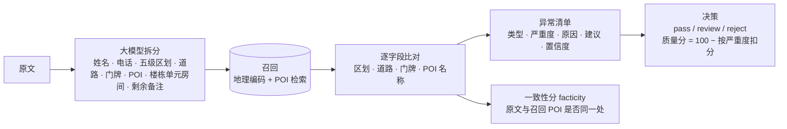

# 14 · 百度国内地址"聚合 agent"拆解（黑盒测试）

> 测的是百度提供的两个大模型地址接口（`apitest2.map.baidu.com`）：`/address_verify_llm/v1` 地址异常校验、`/address_struct_llm/v1` 结构化拆分；对照百度普通地理编码 `/geocoding/v3`。45 条自拟地址，分 18 类（规整、缺省市、错别字、噪声、乱序、小区楼栋、商户名、门牌不存在、区划冲突、方位描述、拼音英文、农村、胡写、多地址、乱码、占位测试、境外、口语）。只覆盖中国大陆，境外地址直接判"不在审核范围"。

## 1. 它是怎么做的（从输出反推）

- **两个分数各管一件事**：`quality_score` 是"写得全不全"（缺一级行政区划扣一次，`上地十街10号` 只有 25 分，尽管定位很确定）；`facticity` 是"原文和召回的点是不是同一处"（同一例 85 分）。
- **异常清单是固定类型 + 大模型写的原因**：`乡镇级地址结构缺失`、`请核对详细信息`（门牌对不上）、`区县级行政区划错误 / 冲突`、`请核对 POI 名称`、`invalid_address`、`out_of_scope`、`地址缺失过多` 等。
- **决策由异常推出**：有 high（区划冲突、无效地址、境外、多地址）判 reject，有 medium 判 review，没有异常才 pass。

## 2. 实测结果

| 输入 | 决策 | 质量分 / 一致性 | 看点 |
|---|---|---|---|
| 规整（`北京市海淀区上地十街10号`） | review | 85 / 88 | 只因"没写乡镇街道"就要人工复核 |
| 缺省市（`上地十街10号`） | review | 25 / 85 | 拆分能反推出北京市海淀区，但质量分扣到 25 |
| 门牌不存在（`上地十街9999号`） | review | 55 / 70 | 召回到 10 号，报"门牌不一致" |
| 区划冲突（`北京市朝阳区上地十街10号`） | review | 50 / 55 | 报 high"区县级行政区划错误" |
| 错别字（`海定区`） | review | 50 / 85 | 能纠正成海淀区，但也报成 high 区划错误 |
| 多地址（`… 或者 …`） | review | 0 / 20 | 拆分把两处都列出；校验报区划冲突 |
| 胡写 / 占位（`asdfgh`、`测试地址123`） | reject | — | `invalid_address`，识别得很干净 |
| 境外（里斯本） | reject | — | `out_of_scope` |
| 商户名（`北京南站`） | review | 40 / 5 | 召回错成"北京市人民政府(原址)"，一致性分把它拦住了 |
| 英文（`Baidu Building Beijing`） | reject | 0 / 5 | 召回跑到山东汶上，反过来说原文"区划错误" |
| 编造（`火星市月亮区星星路1号`） | reject | 0 / 40 | 召回到华蓥市的星星花园，判成"区划冲突"，而不是"地址不存在" |

- **45 条里 38 条 review、6 条 reject、0 条 pass**（1 条调用失败）：连规整地址也要人工复核，主要因为几乎没人写乡镇街道（38 条报了"乡镇级地址结构缺失"）。
- **每次 4–6 秒**（大模型在实时路径上）；普通地理编码毫秒级，但什么都给一个点（编造地址也给"门址"级、可信度 80）。
- **拆分质量好**：姓名、电话（`139-1234-5678` → `13912345678`）、楼栋 / 单元 / 房间、配送备注（`remainder`）都拆得准，缺的省市能按道路反推；但乱码（`锟斤拷烫烫烫`）被当成 POI，`放前台` 的"前台"被当成地名报了异常。

## 3. 和本方案对照

| | 百度聚合 agent | 本方案 |
|---|---|---|
| 解析 | 大模型拆分（4–6 秒） | 规则 + CRF，参考库裁决（毫秒级） |
| 验真依据 | 自家地理编码 / POI 召回，比对字段 | 参考库（官方地址点、路网、POI）逐字段印证 |
| 结论 | pass / review / reject，几乎全是 review | ACCEPT / CONFIRM / FIX，按市场校准直接通过（规整地址多数直接通过） |
| 分数 | 完整度（质量分）+ 一致性（facticity） | 校准过的置信度（= 同类结论的实际正确率） |
| 召回错了 | 一致性分能拦一部分，但会反过来指责原文 | 门牌 / 道路 / 片区必须相互印证，范围守卫防同名路 |
| 覆盖 | 中国大陆 | 44 个市场试点城市 + geo 核对层 |

## 4. 值得借鉴的

1. **无效地址单独判出来**：乱码、占位（`测试地址123`、`xxx路`）、多个地址、境外 / 不在服务范围，给明确的原因码直接拒绝，不混在"找不到"里。
2. **异常带严重度和处理建议**：每个原因码附 high / medium / low 和一句给用户的建议（"请补充门牌号""请确认区县"），前端可以直接展示。
3. **完整度和一致性分开**：除了置信度（对不对），再给"写得全不全"，用来提示用户补字段，但不因为没写乡镇街道就拒绝或要求人工复核。
4. **楼栋 / 单元 / 房间拆开返回**：本方案现在只有一个 `subpremise`；公寓地址（`312号楼2单元1001`、`кв. 15`、`m. 2`、`apto 401 bloco 2`）拆成三个字段更利于派送。
5. **电话规范化、配送备注单独返回**：本方案已有 `nonAddressInfo`，可以补上电话格式规范化。

不借鉴的：大模型放在实时路径（4–6 秒）、因为没写乡镇就扣分 / 复核、召回错了反过来判原文错误。
