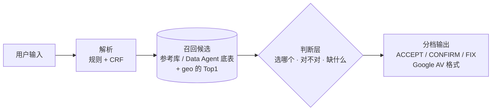

# 15 · 判断层技术选型（Jev 类模型要不要上、怎么上）

> 问题：地址"验真 + 补齐"的链路里，召回候选之后"选哪个、对不对、能不能直接通过"这一步，用什么做？
> 候选方案：现在的规则 + 校准打分、可训练的排序模型、本地开源的判断型模型（Jev 同类）、Jev 托管接口、大模型重排。
> 结论先行：链路结构不变；判断层用悉尼试点数据做一次对比测试再定。按现有数据，判断型模型的价值主要在"判对错、定档位"，不在"多个候选里挑一个"。

## 1. 链路（已定）

召回是确定性的（规则、参考库、底表），判断层只在召回的候选里做选择和判断，不编造地址；答案最坏是"都不对"，不会是一条不存在的路。这一点所有方案都满足。

## 2. 现有数据说明了什么

**真实流量（0924 包，851 条，geo 只给 Top1）**：最终方案没定位对的 305 条里，判断更准能救回的最多 44 条（其中 27 条是规则误判、改规则就行），其余 261 条正确答案不在手里（详见 [00 文档第 6 节](00-final-mvp-solution.md)、[reports/geo_real_eval.md](../mvp/reports/geo_real_eval.md)）。

**悉尼 / 墨尔本开发集**（600 条真实商户地址，有完整官方地址表 G-NAF，本引擎自己召回 Top5 候选）：

| | 条数 |
|---|---|
| 定位对（直接通过 453 + 请用户确认 56） | 509（84.8%） |
| 静默错误（直接通过但错了） | 20 |
| 不对的 91 条里：正确答案在候选里、但没排第一 | 3 |
| 　　　　　　　　候选第一其实就在 250 米内（结论偏保守 / 粒度判低了） | 15 |
| 　　　　　　　　有候选但都不对 | 51 |
| 　　　　　　　　没有候选 | 8 |
| 　　　　　　　　直接通过、严格模式下也拿不到候选（静默错误里的 14 条） | 14 |

读法：
- **"在候选里挑一个"的空间很小**：有完整地址表时，排序错只有 3 条；多数失败是正确答案没被召回（59 条）。
- **"判对错、定档位"的空间大得多**：20 条静默错误（该请确认却直接通过了）、56 条"其实是对的但要求用户确认"（自动化率）、15 条"结论偏保守"。这正是 Jev 类模型的 Noul / Score 题型（"这个候选和原文是不是同一处""现在的信息够不够直接投递"）。
- 所以选型的主要评价标准是**判断准确率 + 置信度校准**，其次才是排序准确率。

## 3. 候选方案

| | 规则 + 校准打分（现状） | 可训练排序模型（GBDT / 逻辑回归，特征 = 现有证据） | 本地开源判断型模型（Laya、NanoJev 等，几亿参数） | Jev 托管接口 | 大模型重排（千问等） |
|---|---|---|---|---|---|
| 能理解原文的写法变化 | 靠规则和别名表 | 靠特征，理解不了没见过的写法 | 能 | 能 | 能 |
| 置信度 | 已校准（同类结论的实际正确率） | 可校准 | 需要自己校准，没有公开评测 | 输出带概率，公开报道里准确率与大模型持平（67.8% 对 67.9%），校准情况没有独立评测 | 需要另做 |
| 延迟 | 1–8 ms | < 1 ms | CPU 上几十毫秒（待测） | 70–500 ms（网络往返） | 秒级 |
| 成本 | 无 | 无 | 本机算力 | 输入每百万 token $0.042 | 高 |
| 数据出境 | 否 | 否 | 否 | **是**（美国公司的托管服务） | 自部署则否 |
| 成熟度 | 已上线评测 | 成熟 | 发布不到一个月，未独立验证 | early access，不到一个月 | 成熟 |
| 需要标注数据 | 少（只校准） | 要（几千条） | 要（微调 / 校准） | 不要（直接用） | 不要 |

Jev 是闭源托管模型，拿不到权重，不能本地部署（[Let's Data Science](https://letsdatascience.com/news/typesafe-ai-launches-jev-decision-model-889a38c0)、[OrcaRouter](https://www.orcarouter.ai/blog/what-is-typesafe-ai)）。开源同类见 [DataCamp 汇总](https://www.datacamp.com/zh/blog/top-open-source-jev-alternatives)。

## 4. 悉尼试点：对比测试怎么做

**数据**（需要从 Data Agent 底表导出）：
1. 悉尼底表：每条地址的编号、完整地址文字、结构化字段（单元、门牌、路名、suburb、邮编、州）、坐标、类型（门址 / POI）、更新时间。
2. 评测对：真实用户输入 + 目标地址编号 / 坐标（和 0924 包同样的形式），悉尼至少 1,000 条；每条附上 geo（GU）的返回，能给 Top3–5 加分数最好。
3. 没有评测对时，用底表生成带噪声的输入（本方案已有合成器），再用 G-NAF 交叉核对；但真实输入的结论更可信。

切分：评测对按 6 : 2 : 2 分成训练 / 开发 / 测试，测试集只在最后跑一次（与 44 个市场的评测同一做法）。

**比什么**（同一套召回候选：底表 + G-NAF + geo Top1，只换判断层）：
- A 规则 + 校准打分（现状）
- B 排序模型（现有证据作特征）
- C 本地开源判断型模型（各题型：选哪个、是不是同一处、能不能直接投递、缺什么）
- D Jev 接口：只用合成或脱敏数据跑，作为对照和对外材料，不进生产
- （可选）E 大模型重排，作上限参考

**看什么**：
- 同样的静默错误率下，直接通过率和定位正确率各是多少；
- 置信度校准：它说 80% 的那一档，实际是不是八成对（每档误差 ≤ 3 个点才可用来分档）；
- 延迟（P95）、单条成本、能否本地部署；
- 按输入噪声程度分开看（干净 / 轻度 / 中度 / 重度）。

**选型规则**：静默错误率不高于现状的前提下，定位正确率 + 直接通过率提升最多、校准合格、P95 ≤ 50 ms、不出境的那个进生产。差距在 1 个点以内时选更简单的（A 或 B）。

## 5. 提前说清楚的

- 判断层只能救"正确答案在候选里"的部分。悉尼有完整地址表时这部分占失败的两成左右（排序错 3 + 偏保守 15，共 18 条，在 91 条里）；能不能缩小与 Google 的差距（真实流量上 54.6% 对 85.4%），主要看底表能不能把正确答案召回进来。
- Data Agent 底表接进来以后，召回能力会变（候选更全），第 2 节的比例要用试点数据重算。
- Jev 接口涉及数据出境：真实客户地址不能直接送过去，试点里只用合成 / 脱敏数据。
